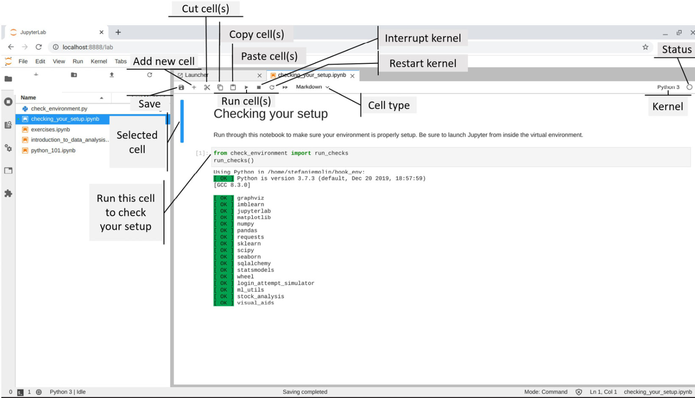

Introduction to Data Analysis
===============================================================

The following topics will be covered in this lab:

-   The fundamentals of data analysis
-   Statistical foundations
-   Setting up a virtual environment

Lab materials
=================

We will use the `check_your_environment.ipynb` notebook to get familiar with
Jupyter Notebooks and to run some checks to make sure that everything is
set up properly for the rest of this book.

While the bulk of this lab doesn\'t involve any coding, feel free to
follow along in the `introduction_to_data_analysis.ipynb`
notebook. 

Since the code that\'s used to generate the content in these notebooks
is not the main focus of this lab, the majority of it has been
separated into the `visual_aids` package, which is used to
create visuals for explaining concepts throughout the book, and the
`check_environment.py` file. If you choose to inspect these
files, don\'t be overwhelmed; everything that\'s relevant to data
science will be covered in this book.

Every lab includes exercises; however, for this lab only, there
is an `exercises.ipynb` notebook, with code to generate some
initial data. Knowledge of basic Python will be necessary to complete
these exercises. For those who would like to review the basics, make
sure to run through the `python_101.ipynb` notebook, included
in the materials for this lab, for a crash course.

### JupyterLab

JupyterLab is an IDE that allows us to create Jupyter Notebooks and
Python scripts, interact with the terminal, create
text documents, reference documentation, and much more from a clean web
interface on our machine.

Using the **File Browser** pane, double-click on the **lab_01** folder,
which contains the Jupyter Notebook that we will use to validate our
setup.

### Validating the Environment

Open the `checking_your_setup.ipynb` notebook in the
**lab_01** folder, as shown in the following
screenshot:

**Important note:**

The **kernel** is the process that runs and
introspects our code in a Jupyter Notebook. Note that we aren\'t limited
to running Python---we can run kernels for R, Julia, Scala, and other
languages as well. By default, we will be running Python using the
IPython kernel. 

Summary
=======

In this lab, we learned about the main processes in conducting data
analysis: data collection, data wrangling, EDA, and drawing conclusions.
We followed that up with an overview of descriptive statistics and
learned how to describe the central tendency and spread of our data; how
to summarize it both numerically and visually using the 5-number
summary, box plots, histograms, and kernel density estimates; how to
scale our data; and how to quantify relationships between variables in
our dataset.
