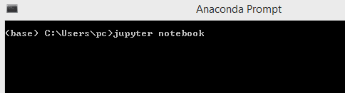
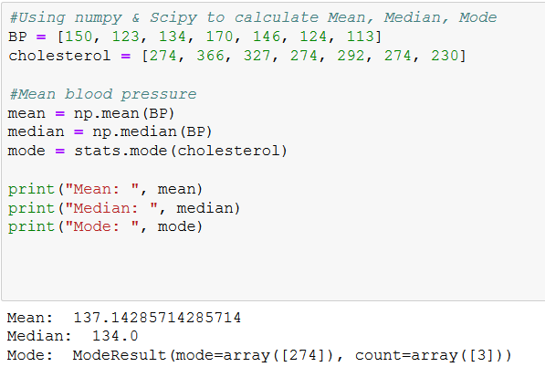
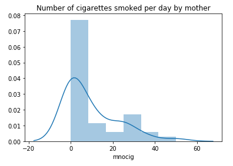

**Lab  1: INTRODUCTION TO STATISTICS**

**Theory**

This lab provides a comprehensive introduction to Statistics, which is a building block for Data Analytics. You will understand the differences between population and sample, different types of variables as well as the types of descriptive statistics measures. 

**What is Statistics?**

Statistics is “*A telescope that allows us to study the large terrain of data and make it accessible to our unaided vision.*” 

**Statistics – Big Picture**

Statistics provides a method of organizing data to extract information on a wider and objective basis rather than relying on personal experience. It is a branch of mathematics working with: 

- Data Gathering
- Data Understanding
- Data Analysis/Interpretation
- Data Presentation

**Basic Statistical Terminology**

**Population Vs Sample**

A population is the collection of all items of interest to our study and is usually denoted with an uppercase N.

Census – It is a process of gathering data from the whole population of interest. For example, elections and a 10-year census, etc.

A sample is a subset of the population and is denoted with a lowercase n.

Survey – It is a process of gathering data from the sample in order to make larger conclusions about  the population. For example, opinion polls, and quality control checks in the manufacturing units, etc.

`	`Image Source: <https://www.snapsurveys.com/blog/wpcontent/uploads/2011/08/target-population.jpg>.

A **population** is the collection of **all** items of interest to our study and is usually denoted with an uppercase **N**. 

Census – It is a process of gathering data from the whole population of interest. For example, elections and 10-year census, *etc.*

A **sample** is a **subset** of the population and is denoted with a lowercase **n.**

Survey – It is a process of gathering data from the sample in order to make conclusions about a certain population. For example, opinion polls, and quality control checks in the manufacturing units, *etc*.

Parameter and Statistic

Parameter: It is defined as a descriptive measure of the population. For example, 

population mean - μ

population variance – σ2

population standard deviation - σ

Statistic: It is defined as a descriptive measure of the sample. For example, 

sample mean - xbar

sample variance - s2

sample standard deviation – s

**Variables and Data** 

Example of data

Source: MTCARS dataset. Data was extracted from the 1974 *Motor Trend* US magazine, and comprises fuel consumption and 10 aspects of the automobile design and performance for 32 automobiles (1973–74 models)

|**Marks  category**|**No. of students**|**% of students**|**Study hours per student**|**Mean marks**|**Standard deviation**|
| :-: | :-: | :-: | :-: | :-: | :-: |
| | | | | | |
|**0 - 10**|4|3.01|2.4|7.93|2.45|
|**11 - 20**|7|5.26|3.1|16.43|2.87|
|**21 - 30**|8|6.02|3.3|24.66|4.33|
|**31 - 40**|13|9.77|3.6|37.43|3.44|
|**41 - 50**|16|12.03|4.5|43.55|3.64|
|**51 - 60**|26|19.55|5.4|57.44|4.11|
|**61 - 70**|35|26.32|5.6|64.33|2.77|
|**71 - 80**|13|9.77|6.5|75.33|2.67|
|**81 - 90**|8|6.02|6.8|83.44|1.66|
|**91 - 100**|3|2.26|7.2|93.22|1.25|

Variables – Dependent and Independent 

An independent variable (experimental or predictor) is a variable that can be manipulated in an experiment in order to observe its effect on the dependent variable(s) (Outcome).

In the above data example, number of hours of study is the independent variable (you can manipulate it by increasing or decreasing your study duration)while the amount of marks obtained is an independent variable (you cannot directly control it, but you can influence it by manipulating the independent variable).

- Dependent variables on y – axis and Independent on x – axis
- Dependent variable is also called Target variable or Class variable.

Data

Data is classified into two types, which are Categorical and Numerical data.

**Categorical Data** (Qualitative) represent types of data which may be divided into groups. For example,  Car brands – Audi, BMW, and Mercedes. Gender – Male, Female.

Sometimes categorical data can hold numerical values (quantitative value), but those values do not have mathematical sense. For instance: birthdates, school postcodes. Here, the birthdate and school postcode hold the quantitative value, but do not give numerical meaning.

**Numerical Data** is also known as quantitative data and represents the numerical value (i.e, how much, how often, how many). Numerical data gives information about the quantities of a specific thing. It is further divided into two groups: Discrete and Continuous numerical data.

- **Discrete** data can be counted finitely. Those values cannot be meaningfully subdivided
  - Example: Number of students in a class: 10, 20, 30.

- **Continuous** data can be calculated, and it has an infinite number of probable values that can be selected within a given specific range.
  - Examples: Hight, Area, Distance, and Time, *etc.*

**Levels of Measurement Scales**

In statistics, there are four data measurement scales: nominal, ordinal, interval, and ratio. These scales are the simple ways to sub-categorize different types of data. 

- Nominal scale: The nominal scale could simply be called “labels”. These scales are mutually exclusive and none of them have any numerical significance. Here are some examples, below

- Ordinal scale: The order of the values is what’s important and significant, but the difference between each one is not characterized well. Here are some examples,

- Interval Scale: Interval scales are numeric scales in which we know both the order and the exact differences between the values. The classic example of an interval scale is Celsius temperature since the difference between each value is the same. For example, the difference between 60 and 50 degrees is a measurable 10 degrees, as is the difference between 80 and 70 degrees. The drawback of interval scales is that they don’t have a “true zero”. For example, there is no such thing as “no temperature”, on the celsius scale. In the case of interval scales, zero doesn’t mean the absence of value, but is actually another number used on the scale, like 0 degrees celsius. Negative numbers also have meaning. Without a true zero, it is impossible to compute ratios. With interval data, we can add and subtract, but cannot multiply or divide.
- Ratio scale: Ratio scales are the ultimate nirvana when it comes to data measurement scales because they tell us about the order and the exact value between units. They also have an absolute zero which allows for a wide range of both descriptive and inferential statistics to be applied. Ratio scales provide a wealth of possibilities when it comes to statistical analysis. These variables can be meaningfully added, subtracted, multiplied or divided (ratios). 

**Descriptive Statistics**

**Crux of Descriptive statistics**

It helps in interpreting the key information from a dataset, which provides us an overview of the data at a glance, viz. Dimensions of the data, distribution of a data and relations between different variables in the data, etc.

Descriptive statistics involves organizing, summarizing, and presenting data in an informative way. Descriptive statistics, unlike inferential statistics, seeks to ‘’describe’’ the data, without drawing interference or making comparisons with the data.

Example: You have exam results of a class of students. You can describe several attributes of this data set such as average score, median score, highest and lowest score, standard deviation, etc. Descriptive data provides you this type of information.  

**Different types of Descriptive Statistics** 

Descriptive statistics are broken down into two categories

- Measure of Central Tendency.
- Measure of Variability (Spread).

Measure of Central Tendency

Central tendency refers to the idea that a single number best summarizes the entire set of measurements, because that number is in some way “*central*” to the dataset.

- Mean: Mean is a central tendency of the data i.e. a number around which a whole data set is spread out. In a way, it is a single number which can estimate the value of the whole data set. The mean has certain characteristics, such as
  - It is the most stable measure
  - It is affected by extreme values
  - It may not exist as data point in the set

Formula to calculate sample mean: 

Here n is the size of the data set, x̄ is the sample mean, and x¡ the numbers in sequence, ∑ is the summation of the entire data set.

Similarly, for a population data of size N, the population mean can be calculated as:

Example: The systolic blood pressure of seven middle aged men is given as:

150, 123, 134, 170, 146, 124, and 113

The mean of these values is = (150+123+134+170+146+124+113)/7 = 137.14

Example: The systolic blood pressure of seven middle aged men with extreme value in:

150, 123, 134, 170, 146, 124, and 1113

The mean is = (150+123+134+170+146+124+1113)/7 = 280

We can see how mean is affected by one extreme value

- Median: Median is the value which divides the data into 2 equal halves based on the number of values i.e. number of terms on right side of it is same as number of terms on left side of it when data is arranged in either ascending or descending order. The median value has certain characteristics such as
  - It may not exist as a data point in the set..
  - It is influenced by position of items, but not their values.
  - Median is not influenced by extreme values.

If the number of values in a data set is odd, then the median is the middle value. If the number of values in the data set is even, the median is the average of middle two values.

Example: if n is odd

The re-ordered systolic blood pressure data:

113, 124, 125, 132, 146, 151, and 170

The median here is 132

Example: if n is even

The re-ordered systolic blood pressure data:

113, 124, 125, 132, 146, 151, 161, and 170

The median here is (132+146)/2 = 139

- Mode: Mode is the most commonly occurring value. It has the following characteristics,
  - It exists as a data point.
  - It is useful for qualitative data.

Example: Six men with high blood cholesterol participated in the study to investigate the effects of diet on cholesterol levels. At the beginning of the study, their cholesterol levels (mg/dl) were as follows:

366, 327, 274, 292, 274, and 230

Rearrange the data in ascending order as follows:

230, 274, 274, 292, 327, and 366

The mode between the two men having the same cholesterol level = 274

But a dataset is possible without mode values if all the values appears the same number of times. If two values appeared same time and more than the rest of the values then the dataset is bi-modal. If three values appeared same time and more than the rest of the values, then the dataset is tri-modal and for n modes, that dataset can be termed as multimodal.

Measure of Variability (Spread / Dispersion)

This measure  helps us to know about the spread of a data set and is called the measure of dispersion.

The mean, median, and mode are usually not by themselves sufficient measures to reveal the shape of a distribution of a data set. We also need a measure that can provide some information about the *variation* among data set values.

The measures that help us to know about the spread of a data set are called measures of dispersion.

The measures of central tendency and dispersion taken together give a better picture of a data set.

- Standard deviation: Standard deviation is the measurement of the average distance between each quantity and the mean value. It shows us how data is spread out from mean. A low standard deviation indicates that the data points tend to be closer to the mean of the data set, while a high standard deviation indicates that the data points are spread out over a wider range of values.

Here (left side) standard deviation is high because, from the mean (x̄), the points are distributed at a longer distance as compared to the right side, where the distance is a bit smaller.

Sample Standard Deviation is denoted by “S”

- The sample standard deviation has the advantage of being in the same units as the original variables (x).
- If the standard deviation is small, the data has low spread (*i.e.,* the majority of points fall very near the mean).
- If standard deviation = 0, there is no spread. This only happens when all data items are of the same value.
- The standard deviation is significantly affected by the outliers and skewed distributions.

Population Standard Deviation is denoted by “σ” (sigma)

- Variance: Variance is the square of average distance between each quantity and mean. In simple words, it is the square of standard deviation.

The variance of Population and Sample

- Range: Range is one of the simplest techniques of descriptive statistics. It is the difference between the lowest and highest value.
  - It has the advantage of being easy to calculate.
  - It is implemented for both “best” or “worst” case scenarios.
  - It is very sensitive for extreme values.

Example: the minimum and maximum blood pressure are 113 and 170,	respectively. Hence the range is 57.

- Percentile: Percentile is a way to represent position of a values in data set. To calculate percentile, values in a data set should always be in an ascending order.

Example: 

12, 24, 41, 51, 67, 67, 85, 99

The median 59 has 4 values, which are smaller than it in a dat set of 8 values. Thus, we can say that 59 is 50th percentile because 50% of the total terms are less than 59. In general, if **k** is **nth** percentile, it implies that **n%** of the total terms are less than **k**.

- Quartile: In statistics and probability, quartile are values that divide your data into quarters, after the data is sorted in an ascending order.

- There are three quartile values. First quartile value is at 25th percentile, second quartile is at 50th percentile, and third quartile is 75th percentile of the total.
- Second quartile (Q2) is the median of the whole data.
- First quartile (Q1) is the median of the upper half of the data.
- Third quartile (Q3) is the median of lower half of the data.
- Quartiles exclude extreme values scientifically.

Example: Points scored per games are:

12, 24, 41, 51, 67, 67, 85, 99, 115

So here, by analogy, 

Middle quartile (50th percentile, Q2) = 67 is 50th percentile of the whole data.

First quartile (25th percentile, Q1) = 41 is 25th percentile and median of upper half of the data.

Third quartile (75th percentile, Q3) = 85 is 75th percentile and median of the lower half of the data.

Interquartile range, IQR = Q3 – Q1 (Central 50% of data) = 85 – 41 = 44

- Skewness: Skewness is the measure of the asymmetry of the probability distribution of a real-valued random variable about its mean. The skewness value can be positive or negative or undefined.

In a data set with perfectly normal distribution, the tails on either side of the curve are exact mirror images of each other, which is also called symmetrical distribution, where mean=median=mode.

When a distribution is skewed to the left, the tail on the curve’s left-hand side is longer than the tail on the right-hand side, and the mean is less than the mode and the median. This is also called the negative skewness.

When a distribution is skewed to the right, the tail on the curve’s right-hand side is longer than the tail on the left-hand side, and the mean is greater than the mode and the median. This is also called the positive skewness.

`      `

Covariance and Correlation

Covariance studies the direction (positive or negative) between two continuous variables, while the Correlation studies the direction and strength between two continuous variables. So the correlation additionally helps understand that how strongly those two continuous variables are associated with each other.

Covariance and correlation are two important concepts and are used in statistics and machine learning. One of the most commonly asked questions is the difference between these two terms and how to decide when to use them in a certain situation. Following are some definitions and mathematical formulas that will help you fully understand the concepts of covariance and correlation.

What is Covariance Matrix?

A covariance matrix is used to study the direction of the linear relationship between different variables. Suppose we have two variables X and Y, and the covariance between these two variables is represented as Cov (X,Y). If ∑(X) and ∑(Y) are the expected values of the variables, then the formula for covariance can be represented as:

Here are some plots that highlight how the covariance between two variables looks like in different directions.

The covariance values of the variables can lie anywhere between -∞ and + ∞. A negative value indicates a negative relationship, whereas a positive value indicates a positive relationship between the variables.

When the unit of observation is changed for one or both of the two variables, the covariance value also changes. However, there is no change in the strength of the relationship.

To better understand the difference between covariance and correlation, let us understand what a correlation matrix is.

**What is a Correlation Matrix?**

A correlation matrix is used to study the strength of a relationship between two variables. It shows the direction of the relationship in addition to showing the strength of it. The formula for the correlation can be represented as:

Where:

- Var(X) = standard deviation of X.
- Var(Y) = standard deviation of Y.

When the two variables move in the same direction, they are positively correlated. On the contrary, when the variables move in the opposite direction, they are negatively correlated with each other.

Fig: Positive relationship

Fig: Negative relationship

The correlation value of two variables ranges from -1 to +1. A value close to +1 indicates a strong positive relation, whereas a value close to -1 indicates a strong negative correlation.

**AIM**

The aim of the following section is to perform various exercises by writing python code so that we can practice hands-on descriptive statistics.

The labs for this lab include the following exercises.

- Introduction to Python and Python versions
- Introduction to Anaconda Python Distribution and Installation
- What are Jupyter notebooks? 
- How does notebook work?
- Installing and launch the Jupyter Notebook.
- Importing necessary packages.
- Calculating the Central Tendencies.
  - Mean
  - Median
  - Mode
- Calculating Measure of dispersion
  - Standard Deviation
  - Variance
  - Range
  - Percentile
  - Quantiles
  - Boxplot
  - Skewness

We will be working with python3 and Jupyter notebook IDE in this lab.

Note: This lab assumes that you are familiar with python and its packages.

**Introduction to Python and Python versions**

Python is an interpreter, object-oriented, high-level programming language with dynamic semantics. Its high-level built-in data structures, combined with dynamic typing and dynamic binding; makes it very attractive for Rapid Application Development. It is also effective for use as a scripting or glue language to connect existing components together. Python's simple, easy to learn syntax emphasizes readability and reduces the cost of program maintenance. Python supports modules and packages, which encourage program modularity and code reuse. The Python interpreter and the extensive standard library are available in source or binary form without charge for all major platforms and can be freely distributed. Python is a great general-purpose programming language on its own, but with the help of a few popular libraries (numpy, scipy, and matplotlib) it has become a powerful environment for scientific computing.

Python Versions

Python 2

Published in late 2000, Python 2 signaled a more transparent and inclusive language development process than the earlier versions of Python with the implementation of PEP (Python Enhancement Proposal), a technical specification that provides information to Python community members and describes a new feature of the language.

Additionally, Python 2 included many more programmatic features including a cycle-detecting garbage collector to automate memory management, increased Unicode support to standardize characters, and list comprehensions to create a list based on existing lists. As Python 2 continued to develop with addition of more features including unifying Python’s types and classes into one hierarchy in Python version 2.2.

Python 3

Python 3 is regarded as the future of Python and is the version of the language that is currently in development. A major overhaul, Python 3 was released in late 2008 to address and amend the intrinsic design flaws of previous versions. The focus of Python 3 was to clean up the code base and remove redundancy, making it clear that there was only one way to perform a given task.

Since its development, Python 3 has undergone further modifications such as changing the print statement into a built-in function, improved ways of dividing the integers, and providing more Unicode support.

At first, Python 3 was slowly adopted due to the incompatibility of the language with Python 2, requiring people to make a decision as to which version of the language to use. Additionally, many package libraries were only available for Python 2. However, with time the development team behind Python 3 has reiterated that there is an end of life for Python 2 support, more libraries have been ported to Python 3. The increased adoption of Python 3 can be shown by the number of Python packages that now provide Python 3 support, which at the time of writing includes 339 of the 360 most popular Python packages.

Python 2.7

Following the 2008 release of Python 3.0, Python 2.7 was published on July 3, 2010 as the last of the 2.x releases. The intention behind the launch of Python 2.7 was to make it easier for Python 2.x users to port features over to Python 3 and provide additional compatibility between the two versions. This compatibility support included enhanced modules for version 2.7 like unit test to support test automation, argparse for parsing command-line options, and more convenient classes in collections.

Because of Python 2.7’s unique position as a version in between the earlier iterations of Python 2.0 and Python 3.0, it has persisted as a very popular choice for the programmers due to its compatibility with many robust libraries. When we talk about Python 2.0 today, we are typically referring to the Python 2.7 release, since that is the most frequently used version.

Python 2.7, however, is considered to be a legacy language and its continued development, which today mostly consists of bug fixes, will cease completely in 2020.

Key Differences

While Python 2.7 and Python 3 share many similar features, they should not be thought of as entirely interchangeable. Though you can write good codes and useful programs in either version, considerable differences exist in the code syntax and handling.

**Anaconda Python Distribution**

Anaconda is an open-source package manager, environment manager, and a publicly-available distribution of the Python and R programming languages. It is commonly used for large-scale data processing, scientific computing, and predictive analytics. It is designed for serving data scientists, developers, business analysts, and those working in DevOps.

Anaconda offers a collection of over 720 open source packages and is available in both free and paid versions. The Anaconda distribution ships with the conda command-line utility. More can be learned about Anaconda and conda by reading the Anaconda Documentation pages.
### Why Anaconda?
- It allows user level installation of the version of python.
- It enables to install/update packages completely independent of system libraries or admin privileges.
- The Conda tool installs binary packages, rather than requiring compile resources like pip - again, handy if you have limited privileges for installing necessary libraries.
- It mostly eliminates the headaches of trying to figure out which version/release of package X is compatible with which version/release of package Y, both of which are required for the installation of package Z.
- It comes either in full-meal-deal version, with numpy, scipy, PyQt, spyder IDE, *etc*. or in minimal / alacarte version (miniconda) where you can install what you want, when you need it.
- It carries no risk of messing up required system libraries.

Anaconda Installation

- [Download the Anaconda Installer(Windows X86_64)](https://repo.anaconda.com/archive/Anaconda3-5.2.0-Windows-x86_64.exe) 

(Other OS https://repo.anaconda.com/archive/)

- **Optional**: Verify data integrity with MD5 or SHA-256 encryption algorithms. More info on hashes.
- Double click the installer to launch the Anaconda. 

- Click Next

- Read the licensing terms and click I Agree.

- Select an installation option of “*Just Me*” unless you’re installing it for all the users (which may require the Windows Administrator privileges).

- Select a destination folder to install Anaconda and click next.

Do not check this box

NOTE: Install Anaconda to a directory path that does not contain spaces or unicode characters.

NOTE: Do not install as ‘*Administrator’* unless the admin privileges are required.

- Choose whether to add Anaconda to your PATH environment variable. However, we recommend not adding Anaconda to the PATH environment variable, since this can interfere with other installed softwares. Instead, use Anaconda software by opening Anaconda Navigator or the Anaconda Command Prompt from the Start Menu.
- Choose  the corresponding option to register Anaconda as your default Python 3.6. Unless you plan on installing and running multiple versions of Anaconda, or multiple versions of Python, you should accept the default option and leave this box checked.
- Click Install. You can click Show Details if you want to see all the packages Anaconda is installing.
- Click Next.
- After successful installation, you will see the “Thanks for installing Anaconda” message.
- You can leave the boxes checked “Learn more about Anaconda Cloud” and “Learn more about Anaconda Support” if you wish to read more about this cloud package management service and Anaconda support. Click Finish.
- After the installation is complete, verify it by opening the Anaconda Navigator, a program that is included with Anaconda. From your Windows Start menu, select the shortcut Anaconda Navigator. If the Navigator opens, it is an indication that you have successfully installed Anaconda.

**What are Jupyter notebooks?**

- The notebook is a web application that allows you to combine the explanatory text, math equations, codes, and visualizations, all in one easily-sharable document.
- Recently, notebooks have quickly become an essential tool while working with data. You'll find their use in data cleaning and exploration, visualization, machine learning, and big data analysis. Typically you'd be doing this work in a terminal, either the normal Python shell or with IPython. Your visualizations would be in the separate windows, any documentation would be in separate documents, along with various scripts for functions and classes. However, with notebooks, all these features are in one place and can be easily explored and navigated together.
- Notebooks are also rendered automatically on GitHub. It’s a great feature that lets you easily share your work. There is also <http://nbviewer.jupyter.org/> that renders the notebooks from your GitHub repository or from notebooks stored elsewhere.
##
##
## **How notebook works?**
Jupyter notebooks grew out of the IPython project started by Fernando Perez. IPython is an interactive shell, like the normal Python shell but with additional features like syntax highlighting and code completion. Originally, notebooks worked by sending messages from the web app (the notebook you can only see in the browser) to an IPython kernel (an IPython application running in the background). The kernel would execute the code, and then sent it back to the notebook. The current architecture is similar, drawn out below.

The central point is the notebook server. You can connect to the server through your browser and the notebook is rendered as a web app. Your written code in the web app is sent through the server to the kernel. The kernel runs the code and sends it back to the server, and then any output is rendered back in the browser. When you save the notebook, it is written to the server as a JSON file with an .ipynb file extension.

The best part of this architecture is the fact that the kernel doesn't need to run Python. Since the notebook and the kernel are separate domains, code in any language can be transformed between them. For example, two of the earlier non-Python kernels were for the R and Julia languages. With an R kernel, code written in R will be sent to the R kernel where it is executed in a manner similar to the running of Python code on a Python kernel. IPython notebooks were renamed because notebooks became language agnostic. The new name Jupyter comes from the combination of Julia, Python, and R. If you're interested, here's a list of available kernels.

Another benefit is that the server can be run anywhere as it can be accessed via the internet. Typically, you'll be running the server on your own machine, where all your data and notebook files are stored. But you could also set up a server on a remote machine or cloud instance like Amazon's EC2. Then, you can access the notebooks in your browser from anywhere in the world.

**Installing and Launching the Jupyter notebook**

By far the easiest way to install Jupyter is with Anaconda. Jupyter notebooks are included in the distribution package. You'll be able to use notebooks from the default environment.

To install *Jupyter* notebooks in a conda environment, use **conda install jupyter notebook**.

Moreover, the Jupyter notebooks are also available through pip with **pip install jupyter notebook**.

Launching Jupyter notebook

- To start notebook server, enter the following command in your Anaconda Prompt
  - $ jupyter notebook

- When you run the command, the server home should open in your browser. By default, the notebook server runs at <http://localhost:8888>  
- If you are not familiar with this, **localhost** means that your computer at port **8888** is communicating with the server. This communication carries on, as long as the server is still running, you can always come back to it by going to <http://localhost:8888> in your browser.
- If you start another server, it’ll try to use port **8888,** but since it is already occupied, the new server will run on port **8889.** Then, you’d connect to it at <http://localhost:8889>. Likewise, every additional notebook server will connect to a port with incremented port number in this fashion.
- If you start your own server, it should look something like this:

- You can create a new notebook by clicking on *new and python3*.

- Now we have launched our new notebook, we can go ahead with implementation.

**Importing the necessary packages**

We always need to import the necessary packages required for the project or task.

**Calculating Central Tendencies** 

**Task 1: Mean, Median, and Mode**

We will be using the data about “systolic blood pressure” and “blood cholesterol levels”  to calculate central tendencies.

We first created BP (Blood Pressure) and plasma Cholestrol variables, then using numpy and scipy.stats packages we calculated the central tendencies (*i.e.* Mean, Median, Mode).

**Calculating Measure of Dispersion**

We will be using a dataset which contains the height and weight of 10 students.

We have created a list of objects to store the data about height and weight.

We have created Pandas Data Frame using the dictionary variable as input:

**Task 2: Standard Deviation**

Standard deviation in the height variable is less than the standard deviation in weight variable. It means that the data points in the height variable are closer to mean, when compared to the data points in weight variable.

**Task 3: Variation**

Variation in height variable is less compared to variation in weight variable.

**Task 4: Range and Percentile** 

Range

Percentile

**Task 5: Quartiles**

25% of the students have the body weight less than 145.5 pounds, 50% of the students have the body weight less than 158 pounds, 75% of students have the body weight less than 164.25 and finally, 50% of students weight lies in the range of 145.5 – 164.25 (i.e. Interquartile range = 18.75).

**Task 6: Boxplot**

Boxplot is also called whisker plot. It is a robust way to identify extreme values (outliers). Boxplot contains upper whisker (*i.e.* Q3+IQR\*1.5) and lower whisker (*i.e.* Q1-1.5IQR). The data points which fall beyond those limits are considered as outlier.

Extreme Low Value

Extreme High Value
 

The above plots show an outlier in each of the height and weight variables. In the height variable, there is an extremely high value and in the weight variable, there is an extremely low value.

**Task 7: Skewness**

We have generated 100 random values using np.random.randn (random normal distribution) function in numpy package and have plotted a distribution plot.  We will be further discussing normal distribution in future labs.

Negatively skewed distribution 

Outliers

Extreme Low Values

Positively skewed distribution

Outliers

Extreme High Values

The distribution of the data will be affected due to a few extreme small (or) large data points called the *outliers*. We can see in the above examples that the symmetric distribution has been completely screwed with the inclusion of few outliers into the dataset. 

**Case Study**

We start our first lab with a relatively easy problem about the reduction in the birth weights.

**Data description**

In 2015, 20.5 million newborns, an estimated 14.6 percent of all babies born globally that year suffered from the low-birth weight problem. These babies were more likely to die during their first month of life and those who survived faced lifelong complications of low birth weight; including a higher risk of stunted growth, lower IQ, and adult-onset chronic conditions, such as obesity and diabetes.

The dataset contains information about new born babies and their parents. The birth weights of the babies whose mothers smoked have been adjusted slightly to exaggerate the difference between mothers who smoked and the ones who did not smoke. 

In this lab, we will be exploring the data by using the descriptive statistics techniques, and then draw some meaningful insights from the data.

**Note**

The original dataset is available at the following link: 

<https://www.sheffield.ac.uk/polopoly_fs/1.937185!/file/Birthweight_reduced_kg_R.csv>

**general description of the variables**

**Understanding the Data**

The main goal of the presented steps is to acquire the basic knowledge about the data, how its various features are distributed, and whether there are any missing volumes in it.

Please import relevant python libraries and data itself for the analysis.

A good starting practice is to check the size of the data we are loading, the number of missing values of each column, and explore the top 5 observations of the dataset:

**Descriptive Statistics**

In order to get simple statistics for the numerical columns, such as the mean, standard deviation, minimum and maximum values, and their percentiles, we can utilize the **describe** function on a **pandas dataset** object

“*Birthweight*” is our dependent variable and the rest of the variables are independent. We want to analyze how the independent variables affect the *Birthweight* variable.

The mean birth weight is 3.312857 and the standard deviation is 0.603895. The maximum and minimum birth weights are 4.57 and 1.92, respectively.

We can analyze the distribution of the birth weight variable.

As you can see that “*Birthweight*” variable is symmetrically distributed around the mean.

Let us analyze the distribution of “**mnocig”** (Number of cigarettes smoked per day by mother) variable.

We can clearly observe that the data is positively or rightly skewed. Boxplot helps us to find out the presence of outliers in “*mnocig*” variable.

We can justify our assumption of outlier with the help of *boxplot*. One important insight we have to note here is that the mean of “*mnocig*” variable is 9.428571 and the median is 4.5. 

Mean is always influenced by an outlier but median is not. We can conclude that mean is not the best descriptive statistic in the presence of outliers in the data.

Thus, 50% of the mothers smoke less than 5 cigarettes per day, and the other 50% of the mothers smoke more than 5 cigarettes per day. To get more precise result, we can go with percentiles.

 

This means that 46% of mothers do not smoke cigarettes, 29% of mothers smoke less than or equal to 16 cigarettes per day, 15% of mothers smoke less than or equal to 25 cigarettes per day and finally, only 10% of mothers smoke more than 25 cigarettes per day.

Now it is time to understand the correlation between the dependent and independent variable.

There is a very weak negative correlation between “*mnocig*” and “*Birthweight*”. We can understand that ‘mnocig’ does not play an important role in determining the “Birthweight” of the child based on the available data.

**Assessment**

**Choose the appropriate option**

1) **Which of the following are the contents of descriptive statistics?**

1. Mean
1. Median
1. Percentile
1. Standard Deviation
1. All of the above

1) **Select an appropriate skewness of the curve From the below image.**

1. Positively Skewed
1. Negatively skewed
1. Symmetric

1) **From the below image select the appropriate relationship between the 2 variables:**

1. Negative Relationship
1. Positive Relationship
1. No Relationship

1) **The value of Correlation between  two continuous variables lies between:**

1. 1 to 100
1. 0 to  1
1. -∞ to +∞
1. -1 to 1

1) **Which of the following statements are true?**

1. All of the students are less than 17 years old		
1. Atleast75% of the students are 10 years old or older
1. There is only one 16 year old at the party
1. The youngest kid is 7 years old
1. Exactly half the kids are older than 13

**Fill in the spaces with appropriate answers**

1) The method used to measure the spread of the data is \_\_\_\_\_\_\_\_\_\_\_\_\_\_\_\_\_\_\_\_\_\_\_\_.?
1) \_\_\_\_\_\_\_\_\_\_\_\_\_\_ is the robust visualization used to identify the outliers in the data.
1) Mean=Median=Mode in \_\_\_\_\_\_\_\_\_\_\_\_ distribution.
1) 4 different data measurement scales are\_\_\_\_\_\_\_\_\_\_\_, \_\_\_\_\_\_\_\_\_\_,   \_\_\_\_\_\_\_\_\_\_\_, \_\_\_\_\_\_\_\_\_\_.
1) The 50th Percentile is also known as \_\_\_\_\_\_\_\_\_\_.

**Programming Assignment** 

Using the data in the below URL, 

` `<https://www.sheffield.ac.uk/polopoly_fs/1.937185!/file/Birthweight_reduced_kg_R.csv>

By referring to the code used in the case study, perform the following tasks:

1) Find the distribution of ‘**fnocig’** (Number of cigarettes smoked per day by father) variable.

1) Find the correlation between ‘**Birthweight’** and ‘**fnocig’** variables.

**Solutions:** Refer to pages 44 - 45

**Solutions for Assessment**

**Choose the appropriate options answers**

1) E
1) C
1) A
1) D
1) A)True B) False C) True D) True and E)True

**Fill in the spaces with appropriate answers:**

1) Measure of Variability (Spread / Dispersion)
1) Boxplot
1) Symmetric
1) Nominal, Ordinal, Interval, and Ratio
1) Median

**Programming Assignment Solution**

Task 1)

Task 2) 

