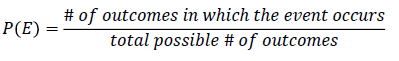
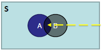
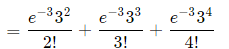

**Lab  3: PROBABILITY DISTRIBUTIONS**

**Theory**

Before we dive deeper into Inferential Statistics, let us first look into the Probability Distributions. This lab covers most of the fundamental topics like Probabilities, Mutually Exclusive & Mutually Non-Exclusive Events, Conditional Probability, Random Variables, and Discrete Probability Distributions.

**What is Probability?**

Probability implies the ‘*likelihood’* or ‘*chance’* of an event. When an event is certain to happen, the probability of occurrence of that event is 1 and when that event is unlikely to hapen, the probability of that event is 0.

**Assigning Probabilities**

Classical method – ***A prior or Theoretical***

Probability can be determined prior to conducting any experiment. It is formulated as follows:

Experiment: Tossing of a fair dice

Outcome: Possible Result of experiment {1, 2, 3, 4, 5, 6}

Sample Space: S = {1, 2, 3, 4, 5, 6}

Event: The thing of our interest, for example: getting a number ‘4’ on dice

P (4) = 1/6 = 1.6667

Empirical Method – ***A posteriori or Frequentist***

Probability can be determined post conducting a thought experiment. It is formulated as follows:

Example 1: Tossing of a weighted die…well! Or Even a fair die.

This is the most frequently used method in the statistical inference.

Example 2: 

100 calls handled by an agent at a call center.

Next, 100 calls are handled by an agent at a call center.

Average over the long run

P (easy) = 0.7

Subjective Method: Based on feelings, insights, knowledge, etc. of a person.

What is the probability of India winning the upcoming series against England?

**Probability Terminology**

Sample Space – Set of all possible outcomes, denoted S.

Example: After two coin tosses, the set of all possible outcomes are {HH, HT, TH, TT}

Event – A subset of the samples space.

An Event of interest might be – HH.

**Probability – Rules**

  

P(S) = 1		       0 <= P (A) <= 1		 P (A or B) = P (A) + P (B)

Area of the rectangle denotes sample space, and since probability is associated with area, it cannot be negative.

Mutually Exclusive

When two events (such as event “A” and event “B” are Mutually Exclusive then it is impossible for them to happen together.

If A and B are mutually exclusive

P (A and B) = 0

But the probability of A or B is the sum of the individual probabilities.

P (A or B) = P (A) + P (B)

Example: A card cannot be a King and Queen simultaneously, when it is picked from a deck of cards. 

The Probability of a card being King is P (king) = 1/13

The Probability of a card being Queen is P (Queen) = 1/13

When we combine these two events: P (King or Queen) = (1/13) + (1/13) = 2/13

P (A or B) = P (A) + P (B) – P (A and B)

Mutually Non-Exclusive Events

Two events A and B are said to be mutually non-exclusive if both of them have at least one common outcome between them.

Events A and B cannot prevent the occurrence of one another, so we can say that events A and B have something common in them.

Example: In the case of rolling a dice, the probability of getting an “even number” and the probability of getting “less than 5” are not mutually exclusive and they are also known as a compatible event.

Let ‘A’ is denoted as event of getting an ‘even number’ and ‘B’ is denoted as event of getting ‘less than 5”.

The events of getting an even number (A) = {**2**, **4**, 6}

The events of getting less than 5 (B) = {1, **2**, 3, **4**}

Between the events A and B, the common outcomes are 2 and 4.

Therefore, events A and B are compatible or mutually non-exclusive events.

**Probability – Types**

Contingency table summarizing two variables, Loan Default and Age:

Convert it into probabilities:

Marginal Probability: It is the probability describing a single attribute.

Example:

P (No) = 0.816	

P (Old) = 0.008

Joint Probability: It is the probability describing a combination of attributes.

Example:

P (Yes and Young) = 0.077

Union Probability: It is the probability describing a new set that contains all the elements that are in at least one of the two sets.

P (Yes or Young) = P (Yes) + P (Young) – P (Yes and Young) = 0.184 + 0.302 – 0.077 = 0.409

Conditional Probability

It is the probability of the occurrence of the event A, given that the event B has occurred.

The sample space is restricted to a single row or column. This makes the rest of the sample irrelevant.

Example:

What is the probability that a person will not default on the loan payment **given** he/she is middle-aged?

P (No | Middle-Aged) = 0.586/0.690 = 0.85

Note that this is the rationale of Joint Probability to Marginal Probability, *i.e*. 

P (A/B) = P (A and B)/P (B) => P (A and B) = P (B) \* P (A/B)

Similarly

P (B/A) = P (A and B)/P (A) => P (A and B) = P (A) \* P (B/A)

Equating, we get,

P (A/B) \* P (B) = P (A) \* P (B/A)

Now, given that the probability that someone defaults on a loan is 0.184, find the probability that an older person will default on the loan. Older people make up only 0.8% of the total clientele. P (Yes/Old) =?

P (Yes/Old) = (P (Yes) \* P (Old/Yes))/P (Old)

P (Yes) = 8557/46687 = 0.184

P (Old/Yes) = P (Old and Yes) / P (Yes) = 120/8557 = 0.014

P (Old) = 379/46687 = 0.008

P (Yes/Old) = (0.184 \* 0.014) / 0.008 = 0.32

The Probability that an older person defaulting on the loan is 32%

**Probability Distributions**

**Histogram:** A series of contiguous rectangles that represent the frequency of data in the given class intervals.

How many class intervals?

Rule of thumb: 5-15 (not too many and not too few)

The Freedman-diaconis rule:

Where the denominator is the bin-width

**Histogram – Excel**

Annual traffic data for the 30 busiest airports in the world – 2013

Source: <http://www.aci.aero/Data-Centre/Annual-Traffic-Data/Passengers/2013-final>

Last accessed: 22 December 2014

**Random Variable**

A Random Variable is a set of possible values from a random experiment.

A random variable can take multiple values with different probabilities. The mathematical function describing these possible values along with their associated probabilities is termed as a *probability distribution*.

Discrete Random Variable

The discrete random variable is a variable that may take on only a countable number of distinct values.

- The discrete random variable is a value that may take on only a countable number of distinct values.
- If a random variable can take only the finite number of distinct values, then it must be a *discrete random variable*.
- The probability distribution of the discrete variable is the list of the probabilities associated with every possible value.

Examples of discrete random variables:

- Number of children in the family.
- The Friday night attendance at a multiplex.
- The total number of defective light bulbs in the box

Suppose a random variable X may take k different values, with a probability that X=x, defined to be P(X = xi) = pi the probabilities pi must satisfy the following:

- 0 <= pi  <= 1
- p1 + p2   + …. + pk = 1.

**Types of Discrete Probability Distributions**

- Bernoulli Distribution.
- Binomial Distribution.
- Poisson Distribution.

**Bernoulli distribution**

A *Bernoulli* distribution is a discrete probability distribution for a Bernoulli trial – a random experiment that has only two outcomes (usually called “*Success*” or “*Failure*”.

A *Bernoulli* distribution is a discrete probability distribution of a random variable which takes 1 with probability ***P*** and the value 0 with probability q = 1-P.

**Notation: X ~ Ber(P)**

Example: The probability (p) of getting a head (“success”), while flipping a coin is 0.5. The probability of “*failure*” is 1-p (1 minus the probability of success, which also equals 0.5 for a coin toss).

**Binomial Distribution**

A binomial distribution is the probability of the “*success*” or “*failure*” outcome of an experiment or survey that is repeated multiple times.

A binomial distribution is the probability of a “success” or “failure” outcome in an experiment or survey that is repeated multiple times.

**Notation: X ~ Bio(n, P)**

**n: number of times the experiment runs**

**p: probability of one specific outcome**

Probability Mass Function: 

Where:

- b = binomial probability.
- x = total number of “success”.
- P = probability of success on an individual trail.
- n = number of trails.

Mean and Variance of Binomial distribution:

**E (X) = np**

**Var (X) = npq**

Criteria – Binominal distribution must meet the following three criteria:

- The number of trials is fixed.
- Each trail is independent of others.
- The probability of “success” (trail, head, fail or pass) is the same from one trail to another.

Example 1: A coin is tossed 10 times. What is the probability of getting exactly 6 heads?

The number of trials (n) is 10.

The odds of success (“tossing a head”) is 0.5 (So 1-P = 0.5)

X = 6

P(X = 6) = 10C6 \* 0.5^6 \* 0.5^ (10-6)

= 210 \* 0.015625 \* 0.0625

P(X=6) = 0.2050

Therefore, the probability of getting exactly 6 heads is 20%

Example 2: Hospital records show that among the patients with a certain disease, ‘75%’ die of it. What is the probability that of six randomly selected patients, four will recover?

This is a binomial distribution because there are only two outcomes (die or survive). 

Let X = number who recover.

Here n=6, X = 4

P=0.25 (success, i.e. they survive), q = 1-P = 0.75 (failure, i.e. die)

P(X=4) = 6C4 \* 0.25^4 \* 0.756-4

P(X=4) = 0.0329

The probability that out of six randomly selected patients, four will recover is 3.29%.

**Poisson distribution**

The Poisson distribution is the discrete probability distribution of the number of events occurring in a given time period, provided that the events occur at a constant mean rate and are independent of the time since last event.

Criteria – Poisson distribution should meet the following criteria: 

- The events can occur independently.
- An event can occur any number of times.
- The rate of occurrence is constant. i.e., the rate does not change based on time.

Probability Mass Function: 

Where: 

- The symbol “!” is a factorial.
- Μ (The expected number of occurrences) is sometimes written as λ. It is sometimes called the event rate or rate parameter.

Mean and Variance of Poisson distribution:

**E (X) =** 𝜆

**Var (X) =** 𝜆

Example 1: The average number of major earthquakes in your city is 2 per year. What is the probability that exactly 3 earthquakes will hit your city next year?

Step 1: Figure out the components you need to put into the equation.

- μ = 2 (average number of earthquakes per year, historically).
- x = 3 (the number of earthquakes we think might hit next year).
- e = 2.71828 (e is Euler’s number, a constant).

Step 2: Plug the values from step 1 into the Poisson distribution formula:

P(x, μ) = (2.71828^-2) \* (23) / 3!

= (0.13534) (8) / 6

P(x, μ) = 0.180

Hence, the probability of 3 earthquakes happening next year is 0.180, or 18%

Example 2: A life insurance salesman sells on average 3 life insurances per week. Use Poisson distribution to calculate the probability that,

1. In a given week he will sell how many policies.
1. In a given week, he will sell 2 or more policies but not more than five policies.
1. Assuming 5 working days per week, what is the probability that on a given day, he will sell one policy?

Here μ = 3

Solution 1: “Some policies” mean “1 or more policies”. We can work this out by computing to find 1 – “zero policies” probability:

P(X>0) = 1 – P(X)

P(X0) = e-3 30 / 0!

= 4.9787 \* 10-2

Therefore, the probability of 1 or more than 1 policy:

P(X>=0) = 1 – (4.9787 \* 10-2)

P(X>=0) = 0.95021

Solution 2: The probability of selling 2 or more policies but less than 5 policies are:

P (2 <= X < 5) = P(X2) + P(X3) + P(X4)

= 061611

Therefore, the probability of selling 2 or more policies but less than 5 policies is 61.16%.

Solution 3: The average number of policies sold per day is 3/5 = 0.6

= 0.32929

Hence, the probability of selling a policy on a given day is 0.32929 or 32.92%.

**Poisson distribution Vs Binomial distribution**

In some cases, it can be challenging to find if you need Binomial distribution or Poisson distribution to fix your statistical problem. If you aren’t given a specific guideline from your instructor, use the following general guideline.

- If you are given an exact probability and you want to find the probability of an event happening for a certain number of times out of x number of times (i.e. 10 times out of 100 or 99 out of 1000), use the Binomial distribution.
- If your question has an average probability of an event per unit (i.e. per unit of time, cycle, event) and you want to find probability of a certain number of events happening in a given period of time (or number of events), use the Poisson distribution.

**AIM**

The aim of the following lab exercises is to perform the partial implementation of the Binomial and Poisson distributions by writing python code, so that we can get hands-on practice of Discrete Probability distributions

The labs for this lab include the following exercises:

- Calculating probability using the Binomial distribution.
- Calculating probability using the Poisson distribution.

We will be working with python3 and the jupyter notebook IDE.

Launching Jupyter notebook

To start the notebook server, enter the following command in your Anaconda Prompt.

After starting the notebook serve, create a new notebook by clicking on new and python3.

Now we have our new notebook, we can go ahead with the implementation.

**Importing the necessary packages**

We always need to import the necessary packages required for the project or task.

**Calculating probability using binomial distribution**

**Task 1:** Hospital records show that among the patients with a certain disease, `75%` die of it. What is the probability that of six randomly selected Patients, four will recover from the disease?

**Step 1**: We need to initiate the n, x, p, and q values.

**Step 2:** Now, let’s use binom.pmf (binomial probability mass function) to calculate the probability that four out of six randomly selected patients will recover.

**Step 3:** Let’s see how the probabilities are distributed among the recovered patients.

Created a dictionary to hold “*number of patients recovered*” values, we used ‘range’ function to generate the values between 0 and 6.

We created the data frame using pandas, DataFrame function.

We defined a lambda function and named it as “prob”. “*A lambda function is a small anonymous function, which can take any number of arguments, but can only have one expression*”.

The objective of “prob” function is to calculate the probabilities, which use binomial probability mass function (binom.pmf).

We calculated probability for each value of “recovery” variable by passing the value to “prob” function and saved the result to a new variable called “probability”.

Interpretation: The probability of recovery of four patients among six randomly selected patients is 3.29%. Similarly, probability of recovery of one patient among six randomly selected patients is 35.59% and finally, probability of recovery of all the six patients is almost 0%.

**Task 2:** In the old days, there was a probability of 0.8  to acquire success in any attempt to make a telephone call. Calculate the probability of having 7 successes (successful calls) in 10 attempts.

Solution: 

Probability of success p=0.8, so q = 0.2 

X = Success in getting through.

Probability of 7 successes in 10 attempts:

Therefore, there is 20% probability of getting 7 successes in 10 attempts to make a call.

**Task 3:** A company drills 9 wildcat oil exploration wells, each with an estimated probability of success of 0.1. What is the probability that all nine wells fail?

Solution:

Probability of success p = 0.1, and failure is q = 0.9

n = 9

There is 38.74% probability that all the nine exploratory drillings will fail.

**Calculating the probability using Poisson distribution**

**Task 4:** John is recording birds in a national park, using a microphone placed in a tree. He is counting the number of times a bird is recorded singing and wants to model the number of birds signing in a minute. For this task, he’ll assume independent of the detected birds.

Looking at the data of the last few hours, John observes that on the average, 3 birds are detected in an interval of one minute. So, the value 3 could be a good candidate for the parameter of the distribution λ. His goal is to know the probability that a specific number of birds will sing in the next minute.

For instance, the probability of John observing 4 birds singing in the next minute would be,

The probability of John observing 4 birds singing in the next minute is around 16.8%

Remember, the function poisson.pmf(k, lambda) takes the value of k and λ and returns the probability to observe k occurrences (*i.e.,* to record k birds singing). 

Let’s plot the distribution for the various values of k:

We created a “lambd” variable to hold average birds recorded in a minute, “k\_values” stores various values of k. Finally, we created distribution variable to store probability values.

We have passed the various k values and a lambda value to poisson.pmf though loop and saved the probabilities into the distribution variable.

The probabilities corresponding to the values of k are summarized in the probability mass function shown in the above figure.

Interpretation: As shown, it is most likely that John will hear two to three birds singing in the next minute.

**Task 5:** If electrical power failures occur according to the Poisson distribution with an average of ‘3’ failures every twenty weeks, calculate the probability of occurrence of 1 failure during a particular week.

In problem statement, λ value was given for 20 weeks. We calculated the average λ value per week as follows:

Therefore, the probability of 1 electrical power failure occurring in a week is 12.91%.

Case Study

John is recording birds’ sounds in a national park, using a microphone placed in a tree. He is counting the number of times a bird is recorded singing, and wants to model the number of birds singing per minute. For this task, he will assume the independence of the detected birds.

Looking at the data of the last few hours, John observes that on average,  3 birds are detected making sounds in an interval of one minute. Thus, the value of 3 could be a good candidate for the parameter of the distribution λ. His goal is to determine the probability that a specific number of birds will sing in the next minute.

For instance, the probability of John observing 4 birds singing in the next minute would be:

The probability of John observing 4 birds singing in next minute is around 16.8%.

Remember that the function *poisson.pmf* (k, lambda) takes the value of k and λ and returns the probability to observe k occurrences (*i.e.*, to record k birds singing). 

Let’s plot the distribution for various values of k:

We created a “*lambd*” variable to hold the average birds’ sounds recorded in a minute, “*k\_values*” stores various values of k and finally, we created the distribution variable to store probability values.

We have passed various k values and a lambda value to *poisson.pmf* though loop and saved the probabilities into the distribution variables.

The probabilities corresponding to the values of k are summarized in the probability mass function shown in the figure.

Interpretation: You can see that it is most probable that John will record two or three birds singing in the next minute.

**Assessment**

**Choose the appropriate option**

1) Which of the following statements best describes the expected value of a discrete random variable?

1. It is the geometric average of all possible outcomes.
1. It is the weighted average over all possible outcomes.
1. It is the simple average of all possible outcomes.
1. None of the above.

1) Which of the following is not a true statement about the binomial probability distribution?

1. Each outcome is independent of each other.
1. Each outcome can be classified as either success or failure.
1. The probability of success must be constant from trail to trail.
1. The random variable of interest is continuous.

1) If n=10 and p = 0.8, then the mean of the binomial distribution is?

1. 0.08
1. 1.26
1. 1.60
1. 8.00

1) If the outcomes of a discrete random variable follow a Poisson distribution, then their

1. Mean equals the variance.
1. Mean equals the standard deviation.
1. Median equals the variance.
1. Median equals the standard deviation.

1) The sum of the product of each value of a discrete random variable X times its probability is referred to as its

1. Expected value.
1. Variance.
1. Mean.
1. Both (a) and (c)

**Fill in the spaces with appropriate answers**

1) The \_\_\_\_\_\_\_\_\_\_\_\_\_\_\_ distribution can be used to approximate the binomial distribution when the number of trails is large and the probability of success is small (np <=7).

1) If n = 10 and p = 0.8, then the standard deviation of the binomial distribution is \_\_\_\_\_\_\_\_\_\_\_\_\_.

1) If two events A and B are mutually exclusive then P (A∩B) = \_\_\_\_\_\_\_\_\_\_\_\_.

1) A coin is tossed up 4 times. The probability that tails turn up in 3 cases is \_\_\_\_\_\_\_\_\_\_.

1) Mutually Exclusive events \_\_\_\_\_\_\_\_\_\_\_\_\_\_\_.

**Programming Assignment** 

Assignment 1

Case study

At a Biscuit factory in Slough with 120 production workers, there is a 10% chance that a worker is absent on a given day. The probability that one worker is absent, assumes that it will not affect the probability that another worker is absent. The factory can operate on any given day as long as no more than 50 workers are absent on that day. What is the probability that any 2 out of 9 randomly chosen workers will be absent on the next Monday?

Solution:

This situation can be described by a Binomial Distribution since we have:

- A fixed number (9) of trails (workers).
- Each trial has two possible outcomes, “success” (the worker is absent) or “failure” (the work is not absent).
- The probability of success (0.1) is constant.
- The outcome of each trial is independent of the outcome of all the other trials.

Using the given values, calculate the probability that any 2 out of 9 randomly-chosen workers will be absent P (X =2)?

Assignment 2

**Case study** 

The average daily sales volume of 60-inch 4K HD TVs at XYZ Electronics is five. Calculate the probability of XYZ Electronics selling nine TV sets today.

**Solution**

We have 

- λ = 5, since five 60-inch TVs in the daily sales average.
- X = 9, we want to solve for the probability of nine TVs being sold.

Using Poisson distribution find the probability, P (X = 9).

**Solutions:** Refer to page 31

**Solutions for Assessment**

**Choose the appropriate options answers**

1) A
1) A
1) D
1) A
1) C

**Fill in the spaces with appropriate answers**

1) Poisson
1) 1.26
1) 0
1) ½
1) Does not contain any common sample point

**Programming Assignment Solutions**

Task 1) 

Task 2)

