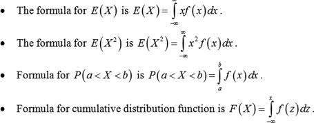
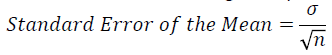
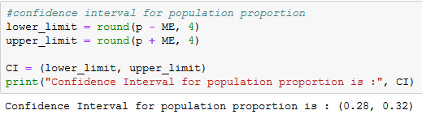

**Lab  4 – INFERENTIAL STATISTICS**

**Theory**

In the previous lab, we studied the probability distributions and discrete random variables. Let us now deep dive and learn about continuous random variables, point estimate, confidence interval estimate, test of hypothesis, and t-test.

**Continuous Random Variable**

A continuous random variable is a random variable, in which the data can take infinitely many values. Continuous random variables usually are the measurements. 

Examples: 

- The time required by computer to process a certain program.
- The amount of rainfall in a certain city at a given time.
- The heat gained by a ceiling fan when it has worked for an hour.
- The amount of water passing through a pipe connected with a high-level reservoir.
- The time in which poultry will gain 1.5kg weight.

The probability function of the continuous random variable is ***probability density function*** (PDF) and represented by the area under a curve. It is formulated as follows:

**Types of Continuous Random Variables**

- Normal Distribution.
- Standard Normal Distribution.
- Uniform Distribution / Rectangular Distribution.

**Normal Distribution**

Normal distribution also known as the Gaussian distribution, is the probability distribution which is symmetric about the mean and shows that the data close to the mean are more frequent in occurrence than the data further away from the mean.

Assumptions of Normal Distribution

- It has a “Bell Shaped Curve”.
- Mean = Median = Mode.
- Zero Skew.
- Area under the curve is 1 (or) 100%.
- Notation: X ~ N (μ, σ2).

Probability Density Function: 

Where: 

- f(x) = probability density function.
- σ = standard deviation.
- μ = mean.

Source: [Image](https://www.google.com/url?sa=i&url=https%3A%2F%2Fdietassessmentprimer.cancer.gov%2Flearn%2Fdistribution.html&psig=AOvVaw1XgzS0U_iBQW9AG8E-q33r&ust=1612116874787000&source=images&cd=vfe&ved=2ahUKEwjms8S-ocTuAhWY_DgGHR_CARgQjRx6BAgAEAc)

In the above image, we can view that the highest point is located at the mean μ, and the spread of the graph can be observed by the standard deviation σ.

Let us understand Probability Density Function with the easiest example where we can have the random variable X with distribution: 

X = {1, 2, 3, 4, 5}

From the above data set, we get the mean (μ) = 3 and standard deviation (σ) = 1.

When we plot it, we get a few distributions like the ones shown in the below figure:

This Bell curve specifies the ***Gaussian / Normal distribution***.

Empirical Formula

The empirical rule states that for the Normal Distribution, nearly all observed data sets will fall within 3 standard deviations. The empirical rule is also known as **Three-Sigma** rule or **68-95-99.7** rule.

More specifically, the empirical rule predicts that:

- 68% of observations falls within the first standard deviation (µ ± σ).
- 95% of observations falls within two standard deviations (µ ± 2σ).
- 99.7% of observations falls within three standard deviations (µ ± 3σ).

Source: <https://lh3.googleusercontent.com/gF03vD4TPhPzzIdJH1X701mkxrLVchWCU_6ZrSPLADfsFU-GRLDFNn7SR0QSZztPvyF8oA=s170>

Example: The animal in the zoo has an average life expectancy of 10 years with a standard deviation of 1.4 years. Assume that the zookeeper attempts to figure out the probability of an animal living for more than 7.2 years. 

The distribution looks as follows:

- One standard deviation (µ ± σ) (10 ± 1.4) = 8.6 to 11.4 years.
- Two standard deviations (µ ± 2σ) (10 ± 2\*1.4) = 7.2 to 12.8 years.
- Three standard deviations (µ ± 3σ) (10 ± 3\*1.4) = 5.8 to 14.2 years.

The empirical rule states that 95% of the distribution lies within two standard deviations. Thus 5% of the observations lies outside the two standard deviations, which include half the values above 12.8 years and the other half below 7.2 years. 

95% + (5% / 2) = 97.5%

Thus, the probability of living more than 7.2 years is 97.5%.

Example 2: Consider the weight values of a population of 15 years old males where the weight is normally distributed and has a mean value =29 and a standard deviation = 6. 

The mean (μ = 29) is in the center of the distribution, while the horizontal axis is scaled in increments of the standard deviation (σ = 6). The distribution essentially ranges from μ - 3σ to μ + 3σ. It is possible to have weight values below 11 or above 47, but such extreme values occur very infrequently. To compute probabilities from the normal distributions, we will compute the areas under the curve. For any probability distribution, the total area under the curve is 1.

In the case of normal distribution, we know that the mean is equal to median, so half (50%) of the area under the curve is above the mean and half is below, P (weight < 29) = 0.50. Consequently, if we select a kid at random from this population and ask his weight, what is the probability that his weight is less than 29kg? The answer is 0.50 or 50%, since 50% of the area under the curve is below the given weight value, which is 29. Note that with normal distribution, the probability of having any exact value is 0 because there is no area at an exact weight value, so in this case, the probability that his weight = 29 is 0, but the probability that his weight < 29 or the probability that his weight is < 29 is 50%.

What is the probability that a 15-year-old male kid weighs less than 35? The probability is displayed graphically and represented by the area under the curve to the left of the value 35 in the figure below.

Note that weight = 35 is 1 standard deviation above the mean. In case of normal distribution  approximately 68% of the area under the curve lies between (µ ± σ). Therefore, 68% of the area under the curve lies between 23 and 35. Moreover, we also know that the normal distribution is symmetric about mean, therefore P (29 < X < 35) = P (23 < X < 29) = 0.34. Consequently, P(X < 35) = 0.5 + 0.34 = 0.84. In other words, 68% of the area is between 23 and 35, so 34% of the area is between 29 and 35, and 50% is below 29. If the total area under the curve is 1, then the area below 35 = 0.50 + 0.34 => 0.84 or 84%. 

**Standard Normal Distribution**

The standard normal distribution is a special case of the normal distribution. It is the distribution that occurs when a normal random variable has the mean value of zero and standard deviation of one.

The normal random variable of a standard normal distribution is called a **Standard Score** or a **Z-Score**. Every normal random variable **X** can be transformed into a **Z-Score** using the following equation:

Where:

- X is a normal random variable.
- μ is the mean of X.
- σ is the standard deviation of X.

For the standard normal distribution, 

- 68% of the observations lie within one standard deviation of the mean.
- 95% of the observations lie within two standard deviation of the mean.
- 99.9% of the observations lie within three standard deviation of the mean.

So far, we have been using “X” to denote the variable of interest (e.g., X=height, X=Weight). However, when using a standard normal distribution, we use “Z” to refer to a variable in the context of a standard normal distribution.

Example:  We were looking at weight in a population of 15-year-old kids, who had normally distributed body weights with a mean value = 29 and a standard deviation = 6.

What is the probability that a randomly selected kid from this population will have a weight less than 30? While a value of 30 doesn’t fall on one of the increments of standard deviation. How can we calculate such probability using standard normal distributions?

Solution: To compute P (X < 30) we convert the X=30 to its corresponding Z score (this is called standardizing):

Z = 30 – 29 /6 => 1/6 

Z = 0.1667

Z = +0.1667

Weight = 30 = 

Since the area under the standard curve = 1, we can begin to define the probabilities of occurrence of specific observation more precisely. The table in the frame below shows the probabilities for the standard normal distribution. Investigate the table and note that a “Z” score of 0.0 lists a probability of 0.50 or 50% and a “Z” score of 1, as one standard deviation above the mean, lists a probability of 0.8413 or 84%. This is because one standard deviation above and below the mean encompasses about 68% of the area, so one standard deviation above the mean represents half of that of 34%. Therefore, the 50% below the mean plus the 34% above the mean gives us 84%. 

Z-table: <http://www.z-table.com/>

The Z value is the number of units of standard deviation which are away from the mean, and the area is the probability of observing a value less than that particular Z value. Also note that the table shows probabilities to two decimal places of Z. The units’ place and the first decimal place are shown in the left-hand column, and second decimal place is displayed across the top row.

But let’s get back to the question about the probability that the weight is less than 30 (P (X < 30)). 

Thus, P (X < 30) = P (Z < 0.1667). We can then look up the corresponding probability for this Z score form the table for standard normal distribution, which shows that P(X < 30) = P (Z < 0.1667) = 0.5636. Thus, the probability that a kid aged 15 has a body weight less than 30 is 56.36%.

**Uniform Distribution / Rectangular Distribution:**

A uniform distribution, also called a rectangular distribution, is a probability distribution that has a constant probability. It has the following characteristics, 

- This distribution is defined by **two parameters**, a and b:
- “a” is the minimum number.
- “b” is the maximum number.
- The distribution is written as U (a, b).
- The following graph shows the rectangular distribution with a=1 and b=3:

Probability density function:

Where: 

- The length of the base of the rectangle is (b-a), 
- The length of the height of the rectangle is 1/ (b-a).
- The area under f(x) and between the endpoints a and b is 1

This distribution has two types. The most common type used in [elementary statistics ](https://www.statisticshowto.datasciencecentral.com/what-is-elementary-statistics/)is the **continuous uniform distribution** (shown as a  rectangle). A second type called the **discrete uniform distribution** also resembles a rectangle but instead of a line, a series of dots represent a known, finite number of outcomes. The following graph shows 5 possible outcomes:

**Continuity Correction Factor:**

A continuity correction factor is applied when you use a continuous probability distribution to approximate a discrete probability distribution. For example: when you want to use the normal distribution to approximate a binomial distribution, following conditions needs to be satisfied.

(n \* p) and (n \* q) >= 5

Where:

- n = how many items are in your sample.
- p = probability of an event happening.
- q = probability of an event not happening.

It is as simple as adding or subtracting 0.5 to the discrete x-value. Accordingly, use the following table to decide whether to add or subtract.

Continuity Correction Factor Table:

- if P (X = n) use P (n - 0.5 < X < n + 0.5)
- if P (X > n) use P(X > n + 0.5)
- If   P(X ≤ n) use    P(X < n + 0.5)
- If    P (X < n) use   P(X < n – 0.5)
- If    P(X ≥ n) use   P(X > n – 0.5)

Example: If n = 20 and p = .25, what is the probability that X >= 8?

**Step 1:** Start by working out n \* p and n \* q >= 5

np = 20 \* .25 => 5 (note: this is also the mean x̄)

nq = 20 \* .75 => 15

Both conditions are satisfied. Thus, we can use Continuity Correction Factor.

**Step 2:** Find the variance of the binomial distribution:

n\*p\*q = 20 \* .25 \* .75 => 3.75

**Step 3:** Apply the Continuity Correction Factor on the X value. For this example, we have a greater than or equals sign (>=), so the table tells us:

P (X>n) use P (X > n – 0.5)

X >= 8 becomes X >= 7.5

**Step 4:** Find the z-score. You will need all three values from above:

- The mean from step 1.
- The variance from step 2.
- The Xi value from step 3.

Zi = 7.5 – 5 / √3.75 => 1.29

**Step 5:** Look up z value in the z-table (<http://www.z-table.com/>)

1.29 = 0.4015

**Step 6:** Subtract probability from 0.5.

0.5 - 0.4015 = 0.0985

The probability that X >= 8 is 0.0985.

**Inferential Statistics**

Inferential statistics use a random sample of data from a population to make inference about the whole population.

Example: To measure the diameter of each nail that is manufactured in a mill is impractical. Instead, you measure the diameters of a representative random sample of nails. Next, you use the information from the sample to generalize about the diameters of all of the nails.

**Sampling Distribution**

The core goal of inferential statistics is to make intelligent conclusions about the population parameters by looking at the sample statistics.

Example: Estimate the mean height of the students in a class, from a small representative sample.

**Sampling Distribution of the Means**

The sampling distribution of means is what you get if you consider all the possible samples of size “**n“,** taken from the same population and then form a distribution of their means. Each randomly selected sample is an independent observation. 

**Central Limit Theorem**

The central limit theorem states that the sampling distribution of the sample means approaches a normal distribution as the sample size gets larger, irrespective of the shape of the population distribution.

This fact holds especially true for sample size which are greater than 30.

Visual demonstration: <http://onlinestatbook.com/stat_sim/sampling_dist/>

**Expectation and Standard deviation of 𝑋** **bar**

Mean of all sample means of size n is the mean of the population.

Standard deviation tells us how far away from the population mean the sample mean is likely to be and is called the **Standard Error of the Mean**, and is represented as follows

**Two Main areas of inferential statistics**

- Estimating Parameters.
- Test of Hypothesis.

**Estimating Parameters**

Parameters are the descriptive measures of an entire population. However, their values are usually unknown, because it is infeasible to measure an entire population. Because of this hindrance, oine can take a random sample from the population and generalize it to the whole population as a parameter estimates. 

One goal of statistical analyses is to obtain estimates of the population parameters and the amount of error associated with these estimates. These estimates are also known as sample statistics.

Example: Sample means are used to estimate the population means:

There are two types of Parameter Estimates:

- Point Estimate
- Confidence Intervals

Point Estimate

A point estimate of a population parameter is a single value of a statistic.

Example: Xbar is a point estimate of the population mean μ. Similarly, the population proportion “p” is a point estimate of the population proportion “P”.

When we use samples to provide population estimates, we cannot be certain that they will be an accurate representation of the whole population. 

For an example of parameter estimates, suppose you work for a bolt manufacturer that is studying a problem of the variations in diameters of bolts. It would be too costly to measure the diameter of every bolt in the company. Instead, you sample 100 randomly selected bolts and measure the diameter in millimeters. The mean of the sample is 9.2. This is the point estimate for the populations mean (μ). You also create a 95% confidence interval for μ which is (8.8, 9.6). This means that you can be 95% confident that the true value of the average diameter of the bolt is between 8.8 and 9.6 mm.

Confidence Intervals

An interval estimate is defined by two numbers, between which a population parameter is said to lie. For example, *a* < x < *b* is an interval estimate of the population mean μ. It indicates that the population mean is greater than “*a”*  but less than “*b”*.

Statisticians use the confidence interval to express the precision and uncertainty associated with a particular sampling method.

A confidence interval is defined as a range of values, derived from the sample statistics that is likely to contain the value of an unknown population parameter. Because of their random nature, it is unlikely that two samples from a particular population will yield identical confidence intervals. But if you repeat your sample several times, a certain percentage of the resulting confidence intervals would contain the unknown population parameter.

The interval estimate of a confidence interval is defined by:

**Confidence Interval = Sample Statistic + Margin of error**

Where:

- Sample statistic for the mean is Xbar.
- Margin of Error is Z score \* SE (Standard Error).

Margin of error is defined as the maximum expected difference between the true population parameter and a sample estimate of that parameter.

Confidence Intervals of Mean, Proportion, and Variance

Mean:

Where:

- Xbar: Sample Statistic.
- Z: Z Score.
- S/square root(n) = Standard Error.

Example:

A survey involving US companies that trade business with firms in India was taken. One of the survey questions was: Approximately how many years has your company been trading with firms in India?  

A random sample of 44 responses to this question yielded a mean of 10.455 years. Suppose that the population standard deviation for this question is 7.7 years. Using this information, construct a 90% confidence interval for the mean number of years that a certain company has been trading with firms in India.

Solution:

- n = 44
- Xbar = 10.455
- σ = 7.7

Confidence interval for the population mean is with 90% probability.

Sample mean ± Margin of Error

Find Za and Zb where P (Za < Z < Zb) = 0.90

P (Z < Za) =0.05 and P (Z > Zb) = 0.05

From Z table: (<http://www2.stat.duke.edu/~rcs46/lectures_2015/14-bayes1/z-table.pdf>)

Therefore, Z value for 5% probability is 1.64.

Za = -1.64 and Zb = 1.64

Margin of error at 90% CI = 1.64 \* (7.7/sqrt (44)) = 1.91

(Xbar – 1.91) < 𝜇 < (Xbar + 1.91)

Since the sample mean is 10.455 years, we get the confidence interval for 90% as 

8.545 < 𝜇 < 12.365

The analyst is 90% confident that if a census of all the US companies trading with firms in India were taken at the time of the survey, the actual population mean number of trading years of such firms would be between 8.545 and 12.365 years.

Proportion:

The population proportion is denoted p and the sample proportion is denoted pˆ, Thus if  43% of people entering a store make a purchase, p = 0.43; if in a sample of 200 people entering the store, 78 make a purchase, pˆ = 78/200 => pˆ = 0.39.

Suppose the random samples of size n are drawn from a population in which the proportion with a characteristic of interest is p. Then mean μP and standard deviation σP^ of the sample proportion 
P^ satisfy,

Where:

- P = sample proportion
- Square root (p(1-p)/n) = Standard Error of sample proportion
- Z = Z score

**Example**: In a poll by FOX News conducted between November 1 and 3, 2016, a survey of 1107 randomly sampled likely voters predicted that 45% would vote for Hillary Clinton:

Then what is the margin of error at 95% confidence level (Z = 1.96)?

Solution:

- n = 1107
- p = 0.45
- q = 0.55
- z = 1.96

Margin of error = 1.96 \* (sqrt ((0.45\*0.55)/1107))

**Margin of error = 2.93%**

t-Distribution:

If the **sample size is small (<30)**, the variance of the population is not adequately captured by the variance of the sample. In such cases, instead of z-distribution, t-distribution is used. It is also the appropriate distribution type to use when the **population variance is not known**.

Degrees of freedom (v) is defined as the number of independent observations for a source of variation minus the number of independent parameters estimated in computing the variation.

When estimating mean of population from a single sample, the number of independent observations is equal to n-1.

Properties of t-Distribution are as follows, 

- Mean of the distribution = 0.
- Variance = v/ (v-2), where v > 2.
- Variance is always greater than 1; although it is close to 1, when there are multiple degrees of freedom (sample size is large).
- With infinite degrees of freedom, t-distribution is the same as the standard normal distribution.

Confidence Interval to Estimate μ:

- Population standard deviation is unknown, and the population is normally distributed.
- Sample mean, standard deviation, and size can be calculated from the data; t value can be inferred from the table.
- α is the area in the tail of the distribution. For 90% confidence level, α* = 0.10. In a confidence Interval, this area is symmetrically distributed between 2 tails (α/2 in each tail).

Example:

The labeled potency of the dosage for a tablet is 100mg. As per the quality control specifications, 10 tablets are randomly assayed for the potency.

A researcher wants to estimate the interval for the true mean of the batch of tablets with 95% confidence. Assume that the potency is normally distributed.

Data are as follows (in mg):

|98.6|102.1|100.7|102|97|
| -: | -: | -: | -: | -: |
|103.4|98.9|101.6|102.9|105.2|

- Mean, Xbar = 101.24 mg
- Standard deviation, S = 2.48
- n = 10
- degree of freedom = 10 -1 = 9
- At 95% level, α = 0.05, and ∴, 𝛼/2=0.025
- t two tailed table ([http://snobear.colorado.edu/Markw//IntroHydro/12/statistics/testchart.pdf](http://snobear.colorado.edu/Markw/IntroHydro/12/statistics/testchart.pdf))

**t value from the table is 2.26**

101.24 – (2.62 \* (2.48/sqrt (10)) ≤ μ ≤ 101.24 + (2.62 \* (2.48/sqrt (10))

99.47 ≤ μ ≤ 103.01

The mean value for the batch is 101.24mg with an error of +/-1.77 mg. The researcher is 95% confident that the average potency of the batch of tablets is between 99.47 mg and 103.01 mg.

Chi Square Distribution for Variance:

A standard normal distribution with **k** degrees of freedom is defined as the distribution of a sum of the squares of **k** independent of standard normal random variables. It is widely used in inferential statistics, notably in deriving confidence interval and hypothesis testing.

Chi Square distribution is positively skewed, with the degree of skew decreasing with increasing degree of freedom. Accordingly, as the degrees of freedom increases, the Chi Square distribution approaches the normal distribution.

You can use the Chi Square distribution to construct the confidence interval for the variance and standard deviation.

Formula:

Where:

- S = Sample standard deviation.
- n = sample size.
- ` `χ² = Chi Square value from Chi Square table.
- All χ² values are greater than or equal to zero.

Critical Values for χ²:

- There are two critical values for each level of confidence.
- The values *χ*2R represent the right-tail critical value.
- The values *χ*2L represent the left-tail critical value.

Example:

You randomly select and weigh 30 samples of an anti-allergy medicine. The standard deviation for the samples is 1.20 milligrams. Assuming that the weights are normally distributed, construct 99% confidence interval for the population variance.

Solution:

- n = 30
- df = n -1 = 30 – 1 = 29
- Area to the right of *χ*2R = (1 – c)/2 = (1 – 0.99)/2 = 0.005
- Area to the left of *χ*2L = (1 + c)/2 = (1 + 0.99)/2 = 0.995
- The critical values are *χ*2R = 52.336 and *χ*2L = 13.121

*χ*2 table (<https://people.richland.edu/james/lecture/m170/tbl-chi.html>)

Confidence Interval for **s2**: 

- Left endpoint: (n – 1)S2/ *χ*2R = (30-1)(1.20)2 / (52.336) = 0.80
- Right endpoint: (n – 1)S2/ *χ*2L = (30-1)(1.20)2 / (13.121) = 3.18

0.80 < **s2** < 3.18

You can conclude with 99% confidence that the population variance is between 0.80 and 3.18 milligrams.

**Confidence Intervals Formulas**

**Test of Hypothesis**

Hypothesis testing is a statistical method for making the statistical decisions about the hypothesis using experimental data. Hypothesis Testing is basically makes an assumption about the population parameter and uses a given sample to test whether or not the statistical claims are likely to be true or not.

Example: 

A school principal claims that the students from her school have an average score of 7/10 in English Proficiency test. You doubt the claim, take a random sample of 40 students for analysis and find a mean score of 5.5/10, with a sample standard deviation of 1. Can you reject the principal’s claim?

Step 1: Decide on the hypothesis.

Average score on the test is 7/10.

This is called **Null Hypothesis** and is represented by H0.

In this case,

**H0: 𝜇 = 0.7**

If the Null Hypothesis is rejected based on evidence, an alternate Hypothesis, H1, needs to be accepted. We always start with the assumption that Null Hypothesis is true.

In this case,

**H1: 𝜇 < 0.7**

Step 2: Choose your statistic,

Sample size = 40

Normal distribution is a good approximation,

Standard Error = s / sqrt (n) = 1.0 / sqrt (40)

Standard Error = 0.158

X ~ N (0.7, 0.1582) = N (0.7, 0.025)

Z = (0.55 – 0.7) / 0.158

**Z = 0.94**

Step 3: Specify the Significance Level.

First, we must decide on the Significance Level, α, which is defined as the measure of how unlikely you want the results of the sample to be before you reject the null hypothesis, H0.

Step 4: Determine the critical region.

If X represents the mean score of the sample, the critical region is defined as P (X < c) < α where α=5%

Recall that in a 95% Confidence Interval (CI), there is a 5% chance that the sample will not contain the population mean. Hence if the sample falls in the critical region, the null hypothesis that 0.7 is the mean score is rejected.

This is the reason that 5% or 0.05 is called the Significance Level. In a 99% CI, 0.01 is the Significance Level.

Step 5: Find the *P*-value

P-value is the probability of getting a value up to and including the one in the sample in the direction of the critical region.

It is a way of taking the sample and working out whether the results fall within the critical region of the hypothesis test.

It indicates how likely it is that a result was obtained by chance alone. Essentially, this is the value used to determine whether to reject the null hypothesis.

If the p-value is small, it indicates the result is unlikely to have occurred by chance alone. These results are known as being statistically-significant results.

- P-value ranges from 0 to 1.
- Small p-value = greater than chance alone (test is significant).
- Large p-value = result is within chance (test is not significant).

If α = 0.05 or 5%, the following rules apply:

- If p < α, the test is statistically significant.
- If p > α, the test is statistically not significant.

In our sample, we found a mean score of 5.5/10. This implies that our p-value is P(X ≤ 0.55), where X is the distribution of the mean scores in the sample.

If P (X ≤ 0.55) < 0.05 (Significance Level), it indicates that 0.55 is inside the critical region, and hence H0 can be rejected.

Given that Z = -0.94, P (X ≤ 0.55) = 0.171           

Thus, there is a 17% probability of finding a mean score of 5.5/10 or less.

Step 6: Is the sample result in the critical region?

The sample result is not in the critical region.

Step 7: Make your decision.

There isn’t sufficient evidence to reject the null hypothesis and therefore, the claim of the principal is accepted.

**Critical Region up Close**

One-tailed tests:

The position of the tail is dependent on H1 (Alternate Hypothesis).

If H1 includes a **“<” sign (lesser than)**, then the lower tail is utilized.

If H1 includes a **“>” sign (greater than)**, then the upper tail is utilized.

Two-tailed tests:

Critical region is split over both ends. Both ends contain α/2, making a total of α. If H1 includes a **“≠” sign (Not equal to)**, then the two-tailed test is used, since we then look for a change in parameter, rather than an increase or a decrease. 

**Types of Errors**

- Type I: We *reject* the NULL Hypothesis incorrectly.
- Type II: We “*accept*” the NULL Hypothesis incorrectly.

Source: <https://www.simplypsychology.org/type-1-and-2-errors.jpg>

Type I error: 

A type I error is also known as the false positive error and occurs when a researcher incorrectly rejects a true null hypothesis. This means that you report that your findings are significant when in fact they have occurred by chance and are statistically not significant. 

The probability of making a type I error is represented by your alpha level (α), which is the p-value below which you reject the null hypothesis. A p-value of 0.05 indicates that you are willing to accept a 5% chance that you are wrong in case the null hypothesis is rejected.

You can reduce the risk of committing a type I error by using a lower value for p. For example: a p-value of 0.01 would mean there is a 1% chance of committing a Type I error.

However, using a lower value for the alpha means that you will be less likely to detect a true difference, if one really exists (thus risking a type II error).

Type II error:

A type II error is also known as false negative and occurs when a researcher fails to reject a null hypothesis which was false. Here a researcher concludes that there is no significant effect, when there really is.

The probability of making a type II error is called Beta (β), and this is related to the power of the statistical test (power = 1- β). You can decrease your risk of committing a type II error by ensuring that your test has enough power.

You can do this by keeping your sample size large enough to detect a practical difference, which truly exists.

Why are Type I and Type II Errors Important?

The consequences of making a type I error mean that unnecessary changes or interventions are made, which results in wastage of time and resources, etc.

Type II errors typically lead to the preservation of the status quo (i.e. interventions remain the same) when in reality a change is required.

Example:

Scientists claim that a new miracle drug cures common cold with a success rate of 90%. You conduct a random sample test on 100 patients and find that 80 of them are cured.

At 5% significant level, do you reject or accept the claim by the scientists?

What are the Null and Alternate Hypotheses?

H0: p = 0.9

H1: p < 0.9

What is the test statistic?

X ~ B (100, 0.9)

Since np>5 and nq>5, Normal distribution can be used instead.

X ~ N (np, npq)

X ~ N (90, 9)

What is the probability of 80 or fewer patients getting cured?

Z = (80.5 – 90) / sqrt (9)

**Z = -3.17**

P-value = P (Z < -3.17) 

**P-value = 0.0008**

Probabilities of Errors in our Example:

Probability of Type I error

P (Type I error) = 0.05

To calculate P (Type II error)

H0: p = 0.9

H1: p = 0.8

P (Z < c) = 0.05 for 5% Significance Value.

From probability tables, c = -1.64

To de-standardize and find values outside the critical region,

X – 90 / sqrt (9) ≥ -1.64

X ≥ 85.08

i.e., we will accept null hypothesis if 85.08 or more people had been cured.

Finally, we need to calculate P(X ≥85.08), assuming H1 is true. X ~ N (np, npq) where n=100 and p=0.8.  This gives X ~ N (80, 16). To calculate P(X ≥85.08) where X ~ N (80, 16), we find:

Z = (85.08 – 80) / sqrt (16)

Z = 1.27

P (Z ≥1.27) = 1 – P (Z < 1.27) = 1-0.8980 = 0.102

P (Type II error) = 0.102

The probability of accepting the null hypothesis that 90% of patients are cured when only 80% are cured in reality is 10.2%.

Power of Hypothesis Test:

We reject null hypothesis correctly when it is false. It is the opposite of Type II error, and therefore,

Power = 1 –β= 1-0.102 = 0.898, i.e.

The probability that we will take the correct decision in rejecting the Null Hypothesis is 89.8%

Common Test Statistics for Inferential Techniques

Inferential techniques (Confidence Intervals and Hypothesis Testing) most commonly use 4 test statistical methods:

**Types of t – tests** 

There are three main types of t-tests:

One sample t – test: It tests the mean value of a single sample group against a known population mean.

An Independent two sample t – test: Compares the mean values from two different group.

A Paired sample t – test: Compares the mean values from the same group at different time-points (say, one year apart).

Two-Sample t-test for Paired Data:

When the effects of two alternative treatments are compared,  it is sometimes possible to make comparisons in pairs, where, e.g. the pair can be the same person at two different time-points or matched pairs where they are alike in all respects.

To study if their mean values are the same – we can create a new data set from the difference of the individual data points.

**Xnew = X1 – X2**

Subsequently, we can look at how far away from zero is the mean E (Xnew)

Example:

A Yoga trainer suggests that the meditation increases concentration. To test this hypothesis, you get 12 volunteers and notes the time it takes to complete a puzzle by them. The next day, you put them through a 30 minute meditation routine and ask them to complete another puzzle of similar difficulty. The time taken for completion is measured again.

You want to test at 5% Significance Level (or 95% Confidence Level) if the time taken is shorter after meditation.

|Time to Solve the puzzle (Minutes)|
| :-: |
|Volume|After|Before|A-B|
|1|63|55|8|
|2|54|62|-8|
|3|79|108|-29|
|4|68|77|-9|
|5|87|83|4|
|6|84|78|6|
|7|92|79|13|
|8|57|94|-37|
|9|66|69|-3|
|10|53|66|-13|
|11|76|72|4|
|12|63|77|-14|
|Total|**842**|**920**|**-78**|
|Mean|**70.17**|**76.67**|**-6.50**|

Mean of the difference, 

Standard Deviation of the differences, 

Standard Error of the mean,

t = - 6.5 / 4.37

**t = -1.487**

Number of degrees of freedom = 12 -1 = 11

Framing the hypothesis

H0: µ1 = µ2 (before = after)

H1: µ1 ≠ µ2 (before ≠ after)

Since H1 includes a **“≠” sign (Not equal to)**, we use the two-tailed test.

**t = -1.487**

**t11, 0.05 = 1.7958**

(From t table)

t = -1.487 lies in

Acceptance Region

1.7958

-1.7958

Ho Rejecting Region

Ho Accepting Region

Comparing the absolute t-value, we **cannot reject** the Null Hypothesis which means that the completion time is taken by two tests is the same.

The 95% CI for the mean difference is given by, 

-6.5 – (1.7958 \* 4.37) ≤ D ≤ -6.5 + (1.7958 \* 4.37)

**95% CI: (14.34, 1.34)**

Since the value zero is included in the CI, we cannot reject the null hypothesis.

**Business Decision**

Although zero is included in CI, the range is very wide, which demands conducting a larger study to confidently assert our conclusion.

Two-Sample t-Test for Unpaired Data:

The Central Limit Theorem states that the difference between the two sample means, (X1bar – X2bar) is normally distributed for large sample sizes (both n1 and n2 ≥ 30) irrespective of the population distribution.

Also,

This is the test statistic for a 2-sample z-test.

H0: µ1 = µ2 

H1: µ1 ≠ µ2 

t-test statistic,

Assuming that the two samples come from the populations with the **Same Standard Deviation** (Rule of thumb: The ratio between the higher S and the lower S is less than 2), pooled variance can be used to calculate SE.

With (n1 and n2 – 2) degrees of freedom

**Example**:

Antibiotic rifampicin increases the amount of drug-metabolizing enzyme present in the liver.  This causes an increase in the rate of elimination of a number of drugs.

An experiment was conducted to study whether rifampicin affects the metabolic removal of the anti-asthma drug, theophylline. A high elimination rate would mean an inadequate treatment of the patient’s asthma.

Two groups of 15 subjects were first with oral rifampicin (600 mg once daily for 10 days) and a placebo drug, respectively. They were then given intravenous injection of theophylline (3 mg/kg of body weight).

Drug levels were measured from the blood samples and efficiency of removal of theophylline was reported as clearance (in ml/min/kg).

|**Clearance of theophylline**|
| :-: |
|**Control Group**|**Treated Group**|
|0.81|1.15|
|1.06|1.28|
|0.43|1.00|
|0.54|0.95|
|0.68|1.06|
|0.56|1.15|
|0.45|0.72|
|0.88|0.79|
|0.73|0.67|
|0.43|1.21|
|0.46|0.92|
|0.43|0.67|
|0.37|0.76|
|0.73|0.82|
|0.93|0.82|

**n1 = 15, X1bar = 0.931, S1 = 0.202, S12 = 0.0408**

**n2 = 15,  X2bar = 0.633, S2 = 0.216, S22 = 0.0467**

Framing the Hypothesis:

H0: µ1 - µ2 = 0 (Rifampicin does not cause a change in theophylline clearance)

H1: µ1 - µ2 ≠ 0 (Rifampicin does cause a change in theophylline clearance)

It is a Two-tailed test.

Sp2 = (((15-1) \* (0.0408)) + ((15-1) \* (0.0467))

(15 - 1) \* (15 + 1)

Sp2 = 0.04375

Sp = 0.209

t = 3.91

You can find the p-value for this t-score by knowing that the t-score is much larger than the critical value for 28 degrees of freedom (~2) at 5% significance level, 

t28, 0.05 = 2.05

t = 3.91 lies in H0 Rejection Region

2.05

-2.05

You see that the p value is in the critical region in the right tail.

Will you reject the null hypothesis or fail to do so?

**Reject**. That means rifampicin does affect the clearance of theophylline.

Does rifampicin increase or decrease the theophylline clearance and by what degree?

As the treated patients exhibited a higher clearance (0.931 ml/min/kg) compared to the control group (0.633 ml/min/kg), rifampicin increases clearance by about 0.298 ml/min/kg).

**Confidence Intervals**

Rewriting

((0.298) – (2.048 \* (0.0763)) ≤ µ1 - µ2 ≤ ((0.298) + (2.48 \* (0.0763))

95% CI: (0.142, 0.454)

Note that the zero difference is unlikely at 95% Confidence Level, as the difference ranges between 0.142 and 0.454 ml/min/kg; with a point estimate for the difference in the mean clearance being 0.298 ml/min/kg.

**Welch’s t-test using Welch-Satterthwaite equation to calculate the degrees of freedom**

When two standard deviations are not equal, we use the above formula.

In this case, the degree of freedom is calculated as:

Round off to the nearest integer.

**AIM**

The aim of the following lab exercises is to perform partial implementation of the Normal distribution, Standard Normal distribution, Confidence Intervals, and Test of Hypothesis by writing python code so that we get hands-on practice of Inferential Statistics.

The labs for this lab include the following exercises.

- Calculating the probability using standard normal distribution.
- Calculating the confidence intervals.
- Performing test of hypothesis.

We will be working with Python3 and jupyter notebook IDE.

Launching Jupyter notebook

To start THE notebook server, enter the following command in your Anaconda Prompt.

After starting the notebook server, create a new notebook by clicking on new and python3.

Now we have our new notebook, we can start with implementation.

**Importing the necessary packages**

We always need to import the necessary packages required for the project or task.

**Calculating probabilities using normal** **and standard normal distributions**

**Task 1:** Generate the data that follows the normal distribution and visualize the distribution.

Step 1: We are generating 10000 data points, which follow the normal distribution with mean = 0 and standard deviation = 1.

The function “np.random.randn” samples 10000 data points from the normal distribution which has mean = 0 and standard deviation = 1.

Step 2: Visualizing the distribution of the data generated.

- In line 1, we set the size of the figure to be (10, 5).
- In line 2, we plotted a histogram with the data we generated.
- Line 3 – 5, we formatted the figure with titles, x-label and y-label.

We can clearly see that the histogram is bell-shaped with a mean value of = 0.

**Task 2:** Generate a normal data set with mean = 65 and standard deviation = 3, and visualize the distribution.

Step 1: In the previous task, we generated a normal data set with default mean and standard deviation values. Here in this task, we will generate a normal data set with mean = 65 and standard deviation = 3.

The function “np.random.normal” helps you to generate normal data set with custom mean and standard deviation values. The function takes three important parameters into consideration:

- loc: The location where the mean of data needs to be.
- scale: It indicates the standard deviation of the data.
- size: The size parameter tells, how many data points to be sampled from the normal distribution.

Step 2: Visualizing the distribution

We can clearly see that the data is normally distributed with mean = 65.

**Task 3:** Students’ scores in 1000 exams are normally distributed with mean values of 65 and a standard deviation of 9. Find the percent of the scores, which are:

1. less than 55.
1. at least 85.
1. between 70 and 80.

Step 1: Generate a score of 1000 exams, which follows the normal distribution with mean = 65 and standard deviation of 9.

Step 2: Visualize the distribution,

The scores of 1000 exams are normally distributed with mean = 65 and standard deviation = 9.

**Task 3:** Calculate the following probabilities:

1. What is the probability of getting an exam score less than 55, P (X < 55)?

Step 1: Calculate the z-score for x = 55.

Step 2: Calculate the area under the curve,

Step 3: Visualize and interpret the results,

` `Python calculates the left / lower-tail probabilities by default.

For this curve z = -1.11 and the area under left is 0.13. Therefore, the probability of getting an exam score less than 55 is 0.13; P (X < 55) is 13%.

1. What is the probability that the exam score will be at least 85; P(X ≥ 85)?

Step 1: Calculate the z-score for x = 85.

Step 2: Calculate the area under the curve.

Step 3: Visualize and interpret the results.

` `Python calculates the left / lower-tail probabilities by default.

For this curve z = 2.22 and the area under right is 0.01. Therefore, the probability of getting an exam score greater than 85 is 0.01; P (X < 85) is 1%.

1. What is the probability that the exam score will be between 70 and 80; P (70 < X < 80)?

Step 1: Calculate the z-score for x = 70 and x = 80.

Step 2: Calculate the area under the curve,

Step 3: Visualize and interpret the results.

` `Python calculates the left / lower-tail probabilities by default.

For this curve, z values are 0.56 and 1.67. Therefore, the probability of getting an exam score between 70 and 80 is 0.24; P (70 < X < 80) is 24%.

**Calculating the confidence intervals**

Computing the confidence interval for a population mean

**Task 4:**  A survey was conducted of the US companies that do business with many firms in India.  One of the survey questions was: Approximately how many years have your company been trading with the firms in India?  

A random sample of 44 responses to this question yielded a mean value of 10.455 years.  Suppose the standard deviation for this population is 7.7 years. Use this information to construct a 90% confidence interval for the mean number of years that a company has been trading in India, out of the population of US companies trading with firms in India.

Step 1: Initialize the variables required for calculating the confidence interval.

Step 2: compute the standard error, margin error, and confidence intervals.

The analyst is 90% confident that if a census of all the US companies trading with the firms in India were taken at the time of the survey, the actual population mean number of trading years would be between 8.45 and 12.36 years.

Calculate the confidence interval for a population mean using t-distribution.

**Task 5:** The labeled potency of a medicinal tablet is 100mg. As per the quality control specifications, 10 tablets are randomly assayed for potency testing.

A researcher wants to estimate the interval for the true mean of the batch of tablets with 95% confidence. Assume that the potency is normally distributed.

Data is as follows (in mg):

|98.6|102.1|100.7|102|97|
| -: | -: | -: | -: | -: |
|103.4|98.9|101.6|102.9|105.2|

Step 1: Initialize the variables required for calculating the confidence interval.

Step 2: Calculate the standard error and margin error.

Step 3: Calculate the confidence interval and interpret it.

The mean for the batch is 101.24mg with an error of +/-1.67mg. The researcher is 95% confident that the average potency of the batch of tablets is between 99.57mg and 102.91mg.

Calculate the confident interval for a population proportion.

**Task 6:** Let’s suppose that on a certain website, out of 1500 visitors on a given day, 450 clicked on an ad purchased by a sponsor. Let’s construct a confidence interval for the population proportion of visitors who clicked on the ad.

Step 1: initialize the variables.

We have initialized the sample proportion and number of sample variables.

Step 2: Calculate the standard error and margin error.

Step 3: Compute the confidence interval for the population proportion.

We are 95% confident that the population proportion falls between 0.28 and 0.32.

Calculate the confidence interval for variance.

**Task 7:** You randomly select and weigh 30 samples of an anti-allergy medicine. The sample standard deviation is 1.20 milligrams. Assuming that the weights are normally distributed, construct the 99% confidence interval for the population variance.

Step 1: initialize the variables.

Step 2: Calculating the confidence intervals.

We are 99% confidence that our population variance falls between 0.7979 and 3.1826.

**Performing Test of Hypothesis**

One sample t-Test

**Task 8:** Suppose a botanist wants to know if the mean height of a certain species of plant is equal to 15 inches. She collects a random sample of 12 plants and records their individual heights in inches.

Use the following steps to conduct a one sample t-test to determine if the mean height for this species of plant is equal to 15 inches.

Step 1: Create the data.

Step 2: Conduct a one sample t-test.

We used the “ttest\_1samp()” function from the “scipy.stats” package to conduct a one sample t-test, which uses the following syntax: 

**ttest\_1samp(a, popmean)**

Where:

- a: an array of sample observations.
- popmean: the expected population mean.

The t-test statistic is -1.6848 and the corresponding two-sided p-value is 0.1201.

The two hypotheses for the one sample t-test are as follows:

H0: µ = 15 (The mean height for this species of plant is 15 inches).

H1: µ ≠ 15 (The mean height is not 15 inches).

Step 3: Interpret the results.

Because the p-value of our test (0.1201) is greater than alpha = 0.05, we fail to reject the null hypothesis. We do not have sufficient evidence to say that the mean height for this specie of plant is different than 15 inches.

Two sample t-test

**Task 9:** Researchers want to know whether two different species of plants have the same mean height. To test this, they collect a simple random sample of 20 plants from each specie.

Use the following step to conduct a two-sample t-test to evaluate if any two species of plants have the same height.

Step 1: Create the data

Step 2: Conduct a two-sample t-test.

Before we perform the test, we need to decide if the two populations have equal variances or not. As a rule of thumb, we can assume that the populations have equal variance if the ratio of the larger sample variance to the smaller sample variance is less than 4:1.

The ratio of the larger sample variance to the smaller sample variance is 1.586, which is less than 4. Thus, we can assume that the population variances are equal.

Next, we proceed to perform the two-sample t-test with equal variances:

We have used the “ttest\_ind()” function from scipy.stats library to conduct a two-sample t-test, which uses the following syntax:

**ttest\_ind(a, b, equal\_var=True)**

Where:

- a: an array of the sample observations for group 1.
- b: an array of the sample observations for group 2.
- equal\_var: if True, perform a standard independent two sample t-test that assumes equal population variances. If False, perform “Welch’s t-test”, which does not assume the equal population variances. This is True by default.

The t-test statistic is -0.6337 and the corresponding two-sided p-value is 0.53005.

Step 3: Interpret the results.

The two hypotheses for this two sample t-test are as follows:

H0: µ1 = µ2 (The mean values for the two populations are equal).

H1: µ1 ≠ µ2 (The mean values for the two populations are not equal).

Because the p-value of our test (0.53005) is greater than alpha = 0.05, we fail to reject the null hypothesis. Thus, we do not have sufficient evidence to say that the mean height of plants between the two populations is different.

Paired sample t-test 

**Task 10**: Suppose we want to know whether a certain study program significantly impacts the student performance in an exam. To test this, 15 students in a class take a pre-test. Then, the students participate in the study program for two weeks. Following this, the students retake a test of similar difficulty.

To compare the difference between the mean scores on the first and second test, we use a paired samples t-test. This is because the first test score can be paired with the second test score for each student.

Perform the following steps to conduct a paired sample t-test.

Step 1: Create the data.

Step 2: Conduct a paired samples t-test.

We used “ttest\_rel()” function from the ‘scipy.stats’ library to conduct a paired samples t-test the following syntax:

**ttest\_rel(a, b)**

where: 

- a: an array of the sample observations from Group 1.
- b: an array of the sample observations from Group 2.

The test statistic is -2.9732 and the corresponding two-sided p-value is 0.0101.

Step 3: Interpret the results.

In this example, the paired samples t-test uses the following Null and Alternative Hypotheses:

H0: µ1 = µ2 (The mean pre-test and post-test scores are equal).

H1: µ1 ≠ µ2 (The mean pre-test and post-test scores are not equal).

Since the p-value (0.0101) is less than 0.05, we can reject the Null Hypothesis. Consequently, we have now sufficient evidence to say that the true scores are different for the students before and after participating in the study program.

**Case Study**

We will be continuing the analysis of dataset labeled as “**birthweight reduced**”. Interestingly, we did not find anystrong and meaningful correlation between “Birthweight” and “mnocig” variables (Lab I: Page 39). Such a conclusion cannot be based solely on the plot observations but has to be backed by the statistical tests.

**Hypothesis Tests**

**Task 1:** **Estimating Average Birth Weight**

Step 1: Start with computing the average birthweight. Note that this value will serve in formulating the *null* hypothesis because, here you explicitly compute the population statistic-or the average birth weight. In most cases, such quantities are not directly observable and, in general, only the estimation for the population statistics is applied:

Step 2: We randomly sample the data and compute the sample mean.

Step 3: Now we perform the one sample t-test to check if there is any significant difference between the sample and population mean.

H0: No difference between population and sample mean.

H1: There is a significant difference between population and sample mean.

The computed p-value is equal to 0.168, which is much larger than the critical 0.05, and therefore, we cannot reject the null hypothesis.

**Task 2:** Compare the means of two independent groups.

Quite often, when performing statistical tests, we want to apply certain statistical tests on two different groups (for example, the average weight between men and women) and estimate whether there is a statistically-significant difference between the values obtained in the two groups. Let’s denote them with µ1 and µ2.

In this exercise, we will be testing the hypothesis on the “*Birthweight*” variable by grouping the data into smokers and non-smokers.

Step 1: We need to group the “*Birthweight*” data based on “smoker” (0: non-smoker, 1: smoker) variable.

Step 2: Perform the two sample t-test to compare the mean.

H0: Average birth weight of smoker’s group – Average birth weight of non-smoker’s group = 0

H1: Average birth weight of smoker’s group – Average birth weight of non-smoker’s group ≠ 0

The resulting p-value from this test is less than 0.05. As a conclusion, we can reject the *null* hypothesis and confirm that our initial observation (*i.e.,* Smoking status of the mother has no effect on the birth weight of the child) is wrong. There is a statistically significant difference between the birth weight of children whose mothers smoke, when compared to the children whose mothers do not smoke.

**Assessment**

**Choose the appropriate option**

1) **Following IQ scores are approximately normally distributed with a mean of 100 and standard deviation of 15. The proportion of people with IQs above 130 is:**

1. 95%
1. 68%
1. 5%
1. 2.5%

1) **Failing to reject the null hypothesis when it is false is:**

1. Alpha
1. Type I error
1. Beta
1. Type II error

1) **A statistic is:**

1. A sample characteristic
1. A population characteristic
1. Unknown
1. Normally distributed

1) **We reject the H0 Hypothesis when:**

1. P-value < alpha
1. P-value > alpha
1. P-value = alpha

1) **People commonly lie when asked questions about personal hygiene.. This is an example of:**

1. Sampling bias
1. Confounding
1. Non-response bias
1. Response bias

**Fill in the spaces with appropriate answers**

1) Because of the possibility of error in sampling from populations, researchers use \_\_\_\_\_\_\_\_\_\_\_\_\_\_\_\_\_ statements to describe results.

1) A t-test is used to compare \_\_\_\_\_\_\_\_\_\_\_\_\_\_\_\_\_\_\_\_.

1) The two forms of two sample t-tests are \_\_\_\_\_\_\_\_\_\_\_\_\_\_\_\_\_\_\_\_\_\_ and \_\_\_\_\_\_\_\_\_\_\_\_\_\_\_\_\_\_.

1) \_\_\_\_\_\_\_\_\_\_\_\_\_\_\_ percent of the data will fall in two deviations in standard normal distribution.

1) An estimate of a population parameter given by two numbers between which the parameter would be expected to lie is called a \_\_\_\_\_\_\_\_\_\_\_\_\_\_\_\_ of the parameter.

**Programming Assignment** 

Using the data in the below URL, 

` `<https://www.sheffield.ac.uk/polopoly_fs/1.937185!/file/Birthweight_reduced_kg_R.csv>

By referring to the code used in the case study perform the following tasks.

1) Find the correlation between “**Gestation**”** and “**Birthweight**” variables.

1) Compute two sample t-test on the “**Gestation**” variable by grouping the data on “**smoker**”.

**Solutions:** Refer to page 69

**Solutions for Assessment**

**Choose the appropriate options**

1) D
1) D
1) A
1) A
1) D

**Fill in the spaces with appropriate answers**

1) Probability
1) Two means
1) Independent and dependent t-test
1) 95%
1) Interval Estimate

**Programming Assignment Solution**

Task 1)

Task 2)

