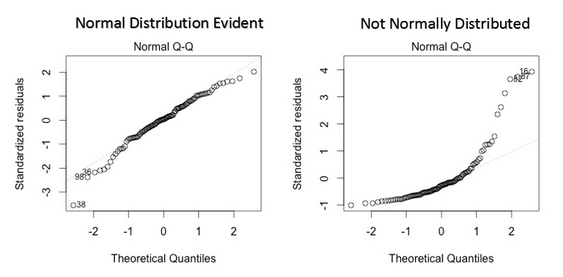
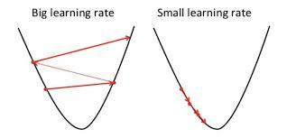
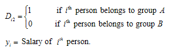

**Lab  6: Regression Analysis - Part I**

**Theory**

Earlier, we worked on data cleaning and wrangling. In this lab, we will learn the core topic of model building for making predictions.

**Regression Analysis**

**Regression analysis is a set of statistical procedures for estimating the relationship between a dependent variable (often called the ‘*outcome variable’* or ‘*target variable’*) and one or more independent variables (often called ‘*predictors’* or ‘*features’*).**

Regression analysis is an important tool for analyzing and modeling data. Here, we fit a line through the data points, in such a manner that the difference between the distances of the actual data points from the plotted line is minimal. 

**The use of Regression Analysis**

Regression analysis investigates the relationship between two or more variables. As an example, consider the following:

Let’s suppose that we develop an application which predicts the chances of admission of a student to a foreign university.  

The benefits of using Regression analysis for calculating these chances are as follows:

- It provides the significant relationships between the label (dependent variable) and the feature (independent variable).
- It shows the extent of the impact of multiple independent variables on the dependent variable.
- It can also quantify these effects even if the variables are on a different scale.

These features enable a data analyst to find the best set of independent variables for making the predictions.

**Linear Regression**

Linear Regression is one of the most fundamental and widely-known Machine Learning Algorithms, and is often the first regression analysis performed on the related dataset. 

Building blocks of a Linear Regression Model are:

- Discrete/Continuous independent variable.
- A best-fit regression line.
- Continuous dependent variable*. i.e*., A Linear Regression model predicts the dependent variable using a regression line based on the independent variables. Linear Regression can be modeled as follows:

**Y = MX + C**

Where,

- Y = Dependent variable
- M = Slope
- X = Independent variable
- C = Constant or Intercept

**Problem Statement**

This data is about the amount spent on advertising certain products through various media channels like TV, radio, and newspaper. The goal is to predict how the expense on each channel affects the sales and is there a way to optimize the sales?

Importing the necessary packages.

Loading and exploring the data.

What are the **features**?

1. TV: Dollars spent on TV ads for a single product in a given market (expressed in multiple of thousands).
1. Radio: Dollars spent on Radio ads (expressed in multiple of thousands).
1. Newspaper: Dollars spent on Newspaper ads (expressed in multiple of thousands).

What is the **response**?

- **Sales**: sales of a single product in a given market (in thousands of widgets).

Dimensions of the data

Find the missing values from different columns:

Let us showcase the relationship between the feature and target variables:

From the relationship diagrams above, it can be observed that there is a linear relationship of the features such as TV ad, radio ad with the sales. A linear relationship typically looks like: 

Hence, we can build a model using the Linear Regression Algorithm.

**Simple Linear Regression**

**A simple linear regression is a method for predicting a quantitative response using a single feature (“*input variable*”).**

The mathematical equation is given as:

***𝑦* =*𝛽*0 + *𝛽*1*𝑥***

What do the terms in the equation represent?

- **Y:** Response or Target Variable
- **X:** Feature Variable
- **𝛽1:** Coefficient of X
- **𝛽0:** Intercept

Where 𝛽0 and 𝛽1 are the **model coefficients**. To create a model, we must "*learn*" the values of these coefficients. Moreover, once we have these values, we can use the model to predict the Sales!

**Estimating (“Learning”) Model Coefficients**

**The coefficients are estimated using the Ordinary Least Squares estimates criterion (OLS], i.e., a best fit line that minimizes the sum of the squared residuals (or “Sum of Squared Error”).**

### **Ordinary Least Squared Estimation**

- In a given two-dimensional space, an infinite number of lines can be plotted through the scatter diagram between the two variables. 
- Calculate the distance between the observed values and predicted values, which are called Errors or Residuals.
- Errors can be positive and negative, therefore square the error term (squared Error) to make them all positive.
- Repeat the process with all infinite number of lines and identify the line with minimum sum of squared error.
- Hence, the name “*Ordinary least Squared*”.

### **The Mathematics involved**
Take a quick look at the plot created. Next, consider the X and Y coordinates of each point. Now draw an imaginary line between the points and the current "best-fit" line. We will call the distance between each point and the current best-fit line as D. To get a quick image of what we're trying to visualize, take a look at the picture below:

What elements are present in the diagram?

- The red points are the observed values of X and Y.
- The blue line is the least square line.
- The green lines are the residual values, which are the distances between the observed values and the least squared line.

Now label each green line as having a distance D, and each red point as having a coordinate of (X, Y). Next, we can define our best fit line as the lines having the property were:

𝐷21+𝐷22+𝐷23+𝐷24+....+𝐷2𝑁

So how do we find this line? The least-square line approximating the set of points:

**(𝑋,𝑌)1,(𝑋,𝑌)2,(𝑋,𝑌)3,(𝑋,𝑌)4,(𝑋,𝑌)5,**

Has the equation:

***𝑦* =*𝛽*0 + *𝛽*1*𝑥***

Basically, it is just a rewritten form of the standard equation for a line:

**Y = MX + C**

### **Derivation of OLS by Minimizing Errors**
Minimize the sum of squared error term by substituting as below:

Solving the above equation by calculus – partial differencing by ***𝛽*0 and *𝛽*1** respectively and solving for the two variables, we get the following equations,

Building Simple Linear Regression Model to predict the sales based on TV ads,

### **Interpreting the model**
How do we interpret the coefficient for spends on TV ad (β1)?

- A “unit” increase in spending on a TV ad is **associated with** a 0.04753 “unit” increase in sales.
- Or, an additional $1,000 on TV ads is translated to an increase in sales by $47.53.
### **Prediction using the model**
If the expense on a TV ad is $50000, what will be the sales prediction for that market?

***𝑦* =*𝛽*0 + *𝛽*1*𝑥***

Y = 7.032594 + 0.047537 \* (50)

Thus, we can predict Sales of 9,409 widgets in that market.

Let’s do the same calculation using the code.

Plotting the least Squares Line:

### **Model Confidence**
**Question:** Is the linear regression a low bias/high variance model or a high bias/low variance model?

**Answer:** It is a High bias/low variance model. Even after repeated sampling, the best fit line will stay roughly in the same position (low variance), but the average of the models created after repeated sampling does not do a great job in capturing the perfect relationship between the two variables (high bias). Low variance is helpful when we don't have less training data! 

If the model has calculated a 95% confidence interval for our model coefficients, it can be interpreted as follows: If the population, from which this sample is drawn, is **sampled 100 times**, then approximately **95 (out of 100) of those confidence intervals** shall contain the "*true*" coefficients.
###
In the coming sections, we discuss more about bias and variance in detail.

### **Hypothesis Testing and p-values**
**Hypothesis testing** is closely related to the confidence intervals. We start with a **null hypothesis** and an **alternate hypothesis** (*i.e.,* opposite to the *null*). Subsequently, we check whether the data **rejects the null hypothesis** or **fails to reject the null hypothesis**.

The conventional hypothesis test is as follows:

- **Null hypothesis:** No significant relationship exists between the TV advertisements and the Sales (and hence, *𝛽*1 equals zero). 
- **Alternative hypothesis:** A significant relationship exists between the TV advertisements and Sales (and hence, *𝛽*1 is not equal to zero).

How do we test this potential relationship? We reject the null hypothesis (and thus believe the alternative hypothesis) if the 95% confidence interval **does not include zero**. The **p-value** represents the probability that the coefficient is actually zero.

If the 95% confidence interval **includes zero**, then the p-value for that coefficient will be **greater than 0.05**. If the 95% confidence interval **does not include zero**, the p-value for the coefficient will be **less than 0.05**. 

Thus, a p-value of less than 0.05 shows that the relationship between the two features in consideration is statistically significant. Conventionally, a cut-off p-value of 0.05 is used for such analysis.

In this case, the p-value for TV ads is far smaller than 0.05, which means that a statistically significant relationship exists between the TV advertisements and Sales.

Note that we generally ignore the p-value for the intercept.

**Multiple Linear Regression**

**A multiple linear regression is a method for predicting a quantitative response using a multiple feature (“*input variable*”).**

Till now, we have studied the models based on only one feature. Now, we’ll include models with multiple features and investigate the potential relationship between those features and the target column. This is called **Multiple Linear Regression**.

**Estimation of model parameters**

Consider the model where,

The columns of X are each covariate for the n number of patients, with the first column having all 1’s to include the intercept in the model.

Based on this model, we get the following expansion for the first subject:

Then using the matrix calculus, we can find that the least square estimate for β is given by,

Hence, the least squares regression line is:

The beta values are obtained by calculating the below equation:

Note:

1. (XTX)-1 should be a non-singular matrix, otherwise, we cannot calculate the value of beta.
1. Beta cannot be calculated if columns are linear combinations of each other.

We know that,

H is called a Hat matrix

Properties of Hat matrix:

1. H is symmetric; HT = H
1. H is idempotent; HH = H

**Assumptions of OLS Regression**

Regression is a parametric approach. ‘*Parametric’* means it makes assumptions about data for the purpose of analysis. Due to its parametric side, regression is restrictive in nature. It fails to deliver trustworthy results from a dataset, which does not fulfill its assumptions. Therefore, for a successful regression analysis, it is essential to validate these assumptions.

Thus, how would you check (validate) if a data set follows all the assumptions for regression? You check it using the regression plots (explained below) along with some statistical test.

Let’s look at the important assumptions in regression analysis:

1. There should be a linear and additive relationship between the dependent (response) variable and independent (predictor) variable(s). A linear relationship suggests that a change in response Y due to a constant change in X1 is the same, regardless of the value of X1. An additive relationship suggests that the effect of X1 on Y is independent of other variables.
1. There should be no correlation between the residual (error) terms: An absence of this phenomenon is known as *Autocorrelation*.
1. The independent variables should not be correlated: An absence of this phenomenon is known as *multicollinearity*.
1. The error terms must have a constant variance. This phenomenon is known as *homoscedasticity*. The presence of non-constant variance is referred to as *heteroskedasticity*.
1. The error terms must be normally distributed.

**What if these assumptions are violated?**

Let’s dive into specific assumptions and learn about their outcomes if the assumptions are violated:

1. **Linear and Additive:**  If you fit a linear model to a non-linear, non-additive dataset, the regression algorithm will fail to capture the trend mathematically, producing an inefficient model. This will also result in erroneous predictions on an unseen dataset.

**How to check for this factor:** Look for residual vs fitted value plots (explained below). 

1. **Autocorrelation:** The presence of correlation in error terms drastically reduces the accuracy of a model. This usually occurs in time series models, where the next instant is dependent on the previous instant. Moreover, if the error terms are correlated, the estimated standard errors tend to underestimate the true standard error.

If this happens, it narrows down the confidence intervals and prediction intervals. Narrower confidence interval means that a 95% confidence interval would have lower probability than 0.95 of containing an actual value of coefficients. Let’s understand the narrow prediction intervals with an example:

For example, the least square coefficient of X1 is 15.02 and its standard error is 2.08 (without autocorrelation). But in the presence of autocorrelation, the standard error is reduced to 1.20. As a result of this reduction, the prediction interval narrows down to (13.82, 16.22) from (12.94, 17.10).

Additionally, the lower standard errors causes the associated p-values to be lower than actual. This can result in the incorrect conclusion that a certain is statistically significant.

**How to check for this factor:** Look for Durbin – Watson (DW) statistics. It must lie between 0 and 4. A DW = 2 implies no autocorrelation. A DW = 0 < DW < 2 implies a positive autocorrelation while DW = 2 < DW < 4 indicates a negative autocorrelation. Additionally,  you can also examine the residual vs time plots and look for the seasonal or correlated patterns in residual values.

1. **Multicollinearity:** This phenomenon exists when the independent variables are found to be moderately or highly correlated. In a model with correlated variables, it is hard to figure out the true relationship of predictors with the response variables. In other words, it is difficult to find out which variable is actually contributing to predict the response variable.

Additionally, with the presence of correlated predictors, the standard errors tend to increase. And, with large standard errors, the confidence interval becomes wider which leads to less precise estimates of slope parameters.

Further, when predictors are correlated, the estimated regression coefficient of a correlated variable depends on the availability of other predictors in the model. If this happens, you’ll make an incorrect conclusion that a given variable strongly or weakly affects the target variable. In such cases, dropping a single correlated variable from the model can change the estimated regression coefficients, which will induce errors.

**How to check for this factor:** You can use scatter plot to visualize the correlation effect among variables. Further, you can also use the VIF factor. VIF value ≤ 4 suggests no multicollinearity whereas a value of ≥ 10 implies strong multicollinearity. Above all, a correlation table should also solve the purpose.

1. **Heteroscedasticity:** The presence of non-constant variance in the error terms results in heteroscedasticity. Generally, non-constant variance arises in the presence of outliers or extreme leverage values. This means that these values get higher than the expected weightage, which disproportionately influences the model’s performance. When this phenomenon occurs, the confidence interval for prediction involving other samples tends to be unrealistically wide or narrow.

**How to check for this factor**: You can look at the plot for the residual vs fitted values. If a heteroscedasticity exists, the plot would exhibit a funnel shape pattern. You can also use *Breusch-Pagan* / *Cook–Weisberg* test or White general test to detect this phenomenon.

1. **Non-normal Distribution of error terms:** If the error terms are non-normally distributed, confidence intervals becomes too wide or narrow. Once the confidence interval becomes unstable, it leads to difficulty in estimating the coefficients based on minimization of least square values. Presence of non – normal distribution suggests that there are a few unusual data points, which must be closely studied to make a better model.

**How to check for this factor:** You can look at the QQ plot (shown below). You can also perform the statistical tests of normality such as Kolmogorov-Smirnov test, Shapiro-Wilk test.

## **Interpretation of Regression Plots**
So far, we’ve learned about the important assumptions for regression and the methods to undertake, if those assumptions get violated.

But that is not the end. Now, you should know the solutions to tackle the violation of these assumptions. In this section, I have explained the 4 regression plots along with the methods to overcome the limitations on assumptions.

1. ## **Residual vs Fitted Values**
## 
This scatter plot shows the distribution of residuals values (errors) vs fitted values (predicted values). It is an important plot to learn for everyone. It reveals several useful insights including outliers into regression model. The outliers in this plot are labeled by their observation numbers which make them easy to detect.

There are two major facts to learn from this:

- If a potential pattern (may be, a parabolic shape) exists in this plot, consider it as a sign of non-linearity in the data. It means that the model doesn’t capture linear effects.
- If a funnel shape is evident in the plot, consider it as the signs of non-constant variance *i.e.,* heteroscedasticity.

**Solution:** To overcome the issue of non-linearity, you can do a nonlinear transformation of predictors such as log (X), √X or X² and transform the dependent variable. To overcome heteroscedasticity, a possible way is to transform the response variable such as log(Y) or √Y. You can also use a weighted least square method to tackle heteroscedasticity.
##
1. ## **Normal Q-Q Plot**
## 
This q-q or quantile-quantile is a scatter plot which helps us validate the assumption of normal distribution in a data set. This plot can be used to infer if the data comes from a normal distribution. In such case, the plot would show a fairly straight line. Absence of normality in the errors can be seen with deviation in the straight line.

If you are wondering what is ‘*quantile’*, here is a simple definition: Quantiles as points in your dataset below which a certain proportion of data falls. Quantile is often referred to as percentiles. For example: when we say the value of the 50th percentile is 120, it means half of the data set lies below 120.

**Solution:** If the errors are not normally distributed, non-linear transformation of the variables (response or predictors) can bring improvement in the model.

1. ## **Scale Location Plot**
## 
This plot is also utilized to detect *homoscedasticity* (assumption of equal variance). It shows how the residuals are spread along a range of predictors. It is similar to residuals vs fitted value plot, except that it uses standardized residual values. Ideally, there should be no discernible pattern in the plot. This implies that the error values are normally distributed. However, if the plot shows a discernible pattern (probably a funnel shape), it would imply a non-normal distribution of errors.

**Solution:** Follow the solution for heteroskedasticity, as given in plot 1.
1. ## **Residuals vs Leverage Plot**
## 
It is also known as Cook’s Distance plot, and attempts to identify the points which have a higher influence on the dataset than the other points. Such influential points tend to have a sizable impact on the regression line. In other words, adding or removing such points from the model can completely change the model statistics.

But, can these influential observations be treated as outliers? This question can only be answered after carefully evaluating the data. Therefore, in this plot, the large values marked by cook’s distance might require further investigation.

**Solution:** For influential observations which are outliers, you can omit them if they are few. Alternatively, you can scale down the outlier observation with maximum value in the data or else treat those values as missing values.
##
##
## **Model Evaluation Metrics**
Model evaluation is a very important procedure in data analysis. It helps you to understand the performance of your model and simplify its presentation. Several evaluation metrics are available but only some of them are suitable for use in regression analysis.

There are 5 major metrics for model evaluation in regression analysis:

1. R Square
1. Adjusted R Square
1. Mean Square Error (MSE) 
1. Root Mean Squared Error (RMSE)
1. Mean Absolute Error

1. **R Square/Adjusted R Square**

R Square measures the amount of variability independent variables, that can be explained by the model. It is the square of Correlation Coefficient (R), hence called R Square. It takes the form of a proportion --- the proportion of variance explained --- therefore, its value is always between 0 and 1.

For example, **R2** statistic = 0.75, it says that our model fits 75% of the whole dataset. Similarly, if it is 0, it means none of the data points is being explained and a value of 1 represents 100% data explanation. Mathematically, **R2** statistic is calculated as:

Where **RSS** is the Residual Sum of Squares and is given as:

RSS is the residual (error) term, whereas, TSS is the Total Sum of Squares and given as:

TSS is calculated when we consider the line passing through the mean value y, to be the best fit line.  This calculation is very similar to the calculation for RSS.

The closer the value of R2 is to 1, the better the model fits our data. If the value of R2 is low (which is a possibility), then the model is so bad that it is performing even worse than the average best fit.

1. **Adjusted R Square**

R Square is a good measure to determine how well the model fits the dependent variables. However, it does not take into consideration the overfitting problem. If your regression model has many independent variables, because it is too complicated, it may fit very well to the training data but perform badly for testing data. Adjusted R Square is introduced to overcome this problem because it penalizes additional independent variables added to the model and adjust the metric to prevent the overfitting issues.

Mathematically, it is calculated as:

Where:

- **R2**: Sample R Square
- **N**: Total Sample Size
- **P**: Number of Independent variables

1. **Mean Square Error (MSE)**

While R Square is a relative measure of how well the model fits the dependent variables, Mean Square Error (MSE) is an absolute measure of the goodness of fit.

MSE is calculated by the sum of prediction error, which is the real output minus the predicted output, and then divided by the number of data points. It gives an absolute number on how much your predicted results deviate from the actual number. You cannot interpret much insight from one single result, but it gives you a real number to compare against other model results, and helps you to select the best regression model.

Mathematically, it is calculated as:

Where:

- **Yi**: actual value
- **Yi hat**: predicted value
- **N**: No. of observations

1. **Root Mean Square Error (RMSE)**

Root Mean Square Error (RMSE) is the square root of MSE. It is used more commonly as compared to MSE, because sometimes MSE values can be too big for easy comparisons. Secondly, MSE is calculated by the square of error, and thus it brings to the same level of prediction error and makes it easier for interpretation.

Mathematically it is calculated as:

Where:

- **Yi**: actual value
- **Yi hat**: predicted value
- **N**: No. of observations

1. **Mean Absolute Error**

Mean Absolute Error (MAE) is similar to Mean Square Error (MSE). However, instead of the sum of square error in MSE, MAE is taking the Sum of Absolute value of error.

Compared to MSEand RMSE, MAE is a more direct representation of the sum of error terms. MSE gives larger penalization to big prediction errors by square them while MAE treats all errors the same way.

Mathematically, MAE is calculated as:

Where,

- **Yi**: actual value
- **Yi hat**: predicted value
- **N**: No. of observations

**Overall Recommendation/Conclusion**

R Square/Adjusted R Square are better applied to explain the model to other people because you can explain the number as a percentage of the output variability. MSE, RMSE or MAE are more useful for comparisons among different regression models.

**Practical Implementation**

**Import our libraries**

The first thing we need to do is to import the libraries we will be using in this case study.

**Load the Data into Pandas**

This dataset was downloaded from the World Bank website; if you intend to visit the website yourself, you can visit the following link. There is a tremendous amount of data available for free, that can be used across a wide range of models.

Link: <https://data.worldbank.org/>

We can observe that a few missing values are represented as (..) in the dataset, we need to replace all the (..) values with “*nan*” as these represent the missing values in our dataset.

We set the index of our data frame using the set\_index() function to the Year column. This step will make the data selection easy. After we have defined the index, we convert the entire data frame to a float data type and then select the years ranging from 1969 to 2016. These years are selected because they do contain missing values.

To make the selection of the columns a little easier, we have renamed all the columns by creating a dictionary where the keys represent the old column names and the values associated with those keys are the new column names.

Finally, I have checked for potential missing values using isnull().any(), which will return *true* for a given column if any values are missing, and then printed the head of the data frame.

**Check for Multicollinearity**

The first thing to do after loading our data is to validate an assumptions of our model; in this case, we will be checking for multicollinearity.

Looking at the heatmap along with the correlation matrix, we can identify a few highly correlated variables. For example, if you look at the correlation between birth\_rate and pop\_growth, it shows a maximal value of 0.98. This is an extremely high correlation and requires removal. Logically, it makes sense that these two are highly correlated; if you are having more babies, then the population should be increasing.

However, we should be more systematic in our approach of removing highly correlated variables. One method for such purpose is the Variance\_Inflation\_Factor, which is a measure of how much a particular variable is contributing to the standard error in the regression model. When significant multicollinearity exists, the variance inflation factor will be huge for the variables in the calculation.

Looking at the above data, we get some confirmation about our suspicion. It makes sense to remove either birth\_rate or pop\_growth, and some of the consumption growth metrics. Once we remove those metrics and recalculate the VIF, we get a passing grade and can move forward.

**Describe the Dataset**

Before we get to an in-depth exploration of the data, or even building the model, we should investigate the data a little more and see how the data is distributed and look for potential outliers. I will be adding a few more metrics to the summary data frame, so that it includes a metric for three standard deviations below and above the mean.

I will store my information in a new variable called *desc\_df*.

-----
It is worth mentioning that we only have 50 observations, but 6 (minus the 3 we dropped) exploratory variables. Many people would argue that we need more data to have these many exploratory variables and this indeed is a correct statement. Generally, we should aim for at least 20 instances for each variable; however, the opinions vary and some statisticians argue that only 10 instances would also suffice.. Regardless,  we only end up with 4 exploratory variables, so that we will satisfy that rule.

Looking at the data frame up above, a few values are standing out, for example, the maximum value in the *broad\_money\_growth* column is almost four standard deviations above the mean, which is such an enormous value qualifies as an outlier.

### **Filtering the Dataset**

To drop or not to drop a value, that is the question. Generally, if we believe that there is an erroneous entry in the data, we should remove it. However, in this situation, the values that are being identified as outliers are correct values and are not errors. Both of these values were produced during specific moments in time. The one in 1998 was right after the Asian Financial Crisis, and the one in 2001 was right after the DotCom Bubble, so it is entirely conceivable that these values were produced in extreme albeit rare conditions. **For this reason, I will NOT be removing these values from the dataset as they recognize actual values that took place.**

Imagine if we wanted to remove the values that have an amount exceeding three standard deviations. How will we approach this? Well, if we leverage the numpy and the scipy modules, we can filter out the rows by using the *stats.zscore* function. The Z-score is the distance of a datapoint in terms of  the number of standard deviations from the mean ., Hence, if it is less than 3 we keep it in the dataset, otherwise we drop it. From here, I have also provided a way to identify what rows were removed by using the *index.difference* the function, which will show the difference between the two datasets.

**Build the model**

Now that we have loaded, cleaned, and explored the data, we can proceed to the next part, which is building the model. The first thing we need to do is, to define our exploratory and our explanatory variables. From here, let’s split the data into training and testing set; a healthy ratio is 20% testing and 80% training but a 30% 70% split also works.

After splitting the data, we will create an instance of the linear regression model and pass through the X\_train and y\_train variables using the *fit( )* function.

**Exploring the output**

With the data now fitted to the model, we can explore the output. The first thing we should do is to look at the intercept of the model, and then print out each coefficient value of the model. I print everything out using a loop to make it more efficient.

The intercept term is the value of the dependent variable, when all the independent variables are equal to zero. For each slope coefficient, it is the estimated change in the dependent variable for a one unit change in that particular independent variable, holding the other independent variables constant.

For example, if all the independent variables are equal to zero, the gdp\_growth would be 2.08%. If we look at the gross\_cap\_form\_growth, while keeping other independent variables constant, we would say that a 1 unit increase in gross\_cap\_form\_growth would lead to a 0.14% increase in GDP growth.

We can also make predictions using our newly trained model. The process is simple; we call the predict method and then pass through some values. In this case, we have some values predefined with the x\_test variable, so we will pass that through. Once we do that, we can select the predictions by slicing the array.

**Evaluating the model**

**Using the Statsmodel**

For diagnosing the model easier, we will, from now on be using the statsmodel module. This module has built-in functions that will help in fast and easy calculations of metrics. However, we will need to "*rebuild*" our model using the statsmodel module. We do this by creating a constant variable, call the *OLS()* method and then the *fit()* method. Now we have a new model, and the first thing we need to do is to ensure that the assumptions of our model hold. This means that we should check the following:

- Regression residuals must be normally distributed.
- The residuals are homoscedastic.
- Absence of multicollinearity (we did this above).
- No Autocorrelation.

**Checking for HeteroScedasticity**

To check for heteroscedasticity, we can leverage the *statsmodels.stats.diagnostic* module. This module gives us a few test functions we can run, the Breusch-Pagan and the White test for heteroscedasticity. The **Breusch-Pagan is a general test for heteroscedasticity, while the White test is a unique case.**

- The null hypothesis for both the White’s test and the Breusch-Pagan test states that the variances for the errors are equal:

**H0 = σ2i = σ2**

- The alternate hypothesis (the one you’re testing), states that the variances are not equal:

**H1 = σ2i ≠ σ2**

We aim to fail to reject the null hypothesis, with a target high p-value because that implies that we found no heteroscedasticity in our dataset.

**Checking for Autocorrelation**

We will go to our favorite *statsmodels.stats.diagnostic* module, and utilize the *Ljung-Box* test for no autocorrelation of residuals. Here:

**H0: The data are random.**

**Ha: The data are not random.**

That means that we want to fail to reject the null hypothesis, or specifically we want a large p-value because it would imply having no autocorrelation. To use the *Ljung-Box* test, we will call the *acorr\_ljungbox* function, pass through the *est.resid* and then define the lags.

The lags can either be calculated by the function itself, or we can calculate them manually. If the function handles it, the max lag will be min((num\_obs // 2 - 2), 40), however, there is a rule of thumb that for the non-seasonal time series, the lag is min(10, (num\_obs // 5)).

Moreover, we can also visually check for the autocorrelation by using the *statsmodels.graphics* module to plot a graph of the autocorrelation factor.

**Checking for Normally Distributed Residuals**

This is an easy check and is visually possible. It **requires using a QQ pplot, which helps us to assess if a dataset plausibly came from some theoretical distribution such as a Normal or exponential.** Remember that it is just a visual check and not an air-tight proof, so it is somewhat subjective.

Visually what we are looking for is the data that hugs the line tightly or is sitting close to the line; this would give us confidence in our assumption that the residuals are normally distributed. Now, it is highly unlikely that the data will perfectly hug the line, so our observation and conclusion are very subjective.
##
## **Checking the Mean of the Residuals Equals 0**
Additionally, we need to check another assumption, that the mean of the residuals is equal to zero. A mean value close to zero is a good thing and we can proceed to the next step. On a side note, it is not uncommon to get a mean value that is not exactly zero; which happens due to rounding errors. However, if the mean value is very close to zero, we can confidently use it. In the example below, you may see that the mean value is not exactly zero.

**Measures of Error**

We next examine that how well our data fit the model, so we take the y\_predictions and compare them to our y\_actuals which will be our residuals. From here we can calculate a few metrics to help quantify how well our model fits the data. Here are a few popular metrics:

- **Mean Absolute Error (MAE):** MAE Is the mean of the absolute value of the errors. This gives us an estimate of magnitude but no sense of direction (too high or too low).
- **Mean Squared Error (MSE):** MSE Is the mean of the squared errors. MSE is more popular than MAE in such calculations, because MSE "*punishes*" more significant errors.
- **Root Mean Squared Error (RMSE):** RMSE Is the square root of the mean of the squared errors. RMSE is even more favored in such calculations, because it allows us to interpret the output in y-units.

Fortunately, both **sklearn** and **statsmodel** contain functions, that can calculate these metrics. The examples below were calculated using the *sklearn* library and the *math* library.

**R-Squared**

The R-Squared metric provides us a way to measure the goodness of fit or, in other words, how well our data fits the model. A higher value of the R-Squared metric means a better fit for our model. However, one limitation of this calculation is that the value of R-Square increases as the number of features increase in our model. This implies that if we keep adding variables including poor choices, the R-Squared will go further up! **A more popular metric is the adjusted R-Square which penalizes more complex models, or in other words, the models with more exploratory variables.** In the example below, the regular R-Squared value has been calculated; however, the statsmodel summary calculates the adjusted R-Squared below.

**Confidence Intervals**

Let us look at our confidence intervals. Keep in mind that by default, the confidence intervals are calculated using 95% intervals. We interpret confidence intervals by saying that if we sample our target population a 100 times, **approximately 95 of those confidence intervals would contain the "true" coefficient.**

Why do we provide a confidence range? Well, this is because we only have a sample of the population, and not the entire population to collect data from. Because of this limitation, that the "true" coefficient may exist in the interval below or it may not exist although we are not sure about that. We provide some uncertainty by providing a range, usually 95%, where the coefficient is probably in.

- Want a narrower range? **Decrease your confidence**.
- Want a wider range? **Increase your confidence**.

**Hypothesis Testing**

With hypothesis testing, we try to determine the statistical significance of the coefficient estimates. This test is outlined as the following:

- **Null Hypothesis:** There is no significant relationship between the exploratory and the explanatory variables.
- **Alternative Hypothesis:** There is a significant relationship between the exploratory and the explanatory variables.
- If we **reject the null**, we imply that there is a significant relationship between exploratory and explanatory variables, but the coefficients do not equal 0.
- If we **fail to reject the *null***, it means that there is no relationship, and the coefficients do equal 0.

This is difficult to explain, but we have a few insignificant coefficients in such analysis. The first of them is the constant itself, so technically this should be dropped. However, we will see that once we remove the irrelevant variables, the intercept becomes significant. **If it is still not significant, we start the intercept at 0 and assume that the cumulative effect of X on Y begins from the origin (0, 0).**  Along with the constant, we have *unemployment* and *broad\_money\_growth* both come out as insignificant.

**Create a Summary of the Model Output**

Let us create a summary of some of our keep metrics; *sklearn* does not have a good way of creating this output, so we calculate all the parameters ourselves. Let us avoid this calculation and use the statsmodel.api library. With this library, we can create the same model we created above, but we also leverage the *summary()* method to create an output. Some of the metrics might differ slightly, but they generally should be the same.

The first thing to notice is that the p-values are now easier to read and we can now remove the coefficients with p-values greater than 0.05. We also have the 95% confidence interval (described up above), coefficient estimates (described up above), standard errors, and t-values.

The other metric that stands out is the Adjusted R-Squared value which is 0.878, lower than the R-Squared value. This makes sense since we were probably docked for the complexity of our model. However, an R-Squared over 0.878 is still very strong.

The only additional metrics we describe here is the t-value which is the coefficient divided by the standard error. The higher the t-value, the more evidence we have to reject the null hypothesis. Also, remember that the standard error is the approximate standard deviation of a statistical sample population.

**Remove the Insignificant Variables**

Now that we have identified the insignificant variables, we should remove them from the model and refit the data to see what we get. The steps are the same. The only thing I have changed is the removal of additional columns from the data frame.

**Looking at the output, we find that all the independent variables are significant and the constant is significant.** We could rerun our test for autocorrelation and, but this will take you to the same conclusions we found above, so I have decided to leave that from the lab. At this point, we can interpret the formula and begin making predictions. Looking at the coefficients, we can say that the *pop\_growth, gross\_cap\_from\_growth,* and *hh\_consum\_growth* all have a positive effect on GDP growth. Additionally, we can say that the gov\_final\_consum\_growth has a negative effect on GDP growth, This is a slightly surprising finding, but we will have to find its reason.

**Save the Model for Future Use**

We will probably use this model in the future, so let us save our work for the future use. Saving the model can be achieved by storing our model in a pickle, which is storing a *python* object as a character stream in a file, which can be later reloaded for use.

**Summary**

Regression models describe the relationship between variables by fitting a line to the observed dataset. Generally, the linear regression models use a straight line. Regression allows us to estimate how a dependent variable changes with the change in the independent variables. Simple linear regression is used to estimate the relationship between two quantitative variables, whereas multiple linear regression is utilized to estimate the relationship between two or more quantitative and qualitative variables. 

**Assessment**

**Choose the appropriate option**

1) **Which one of the following are regression tasks?**

1. Predict the age of a person
1. Predict the country from where the person comes from
1. Predict whether the price of petroleum will increase tomorrow
1. Predict whether a document is related to science

1) **Which of the following plots is used for normality test?**

1. Scatter plot
1. Bar plot
1. qqplot
1. None of these

1) **Which of the following tests is used for heteroscedasticity?**

1. AD
1. Ljung-Box
1. Breusch-Pagan
1. All of the above

1) **Which of the following tests is used for *autocorrelation*?**

1. AD
1. Ljung-Box
1. Breusch-Pagan
1. White test
1) **VIF > 10 is said to be:**

1. No Multicollinearity
1. Less Multicollinearity
1. High Multicollinearity
1. None of the above

**Fill in the spaces with appropriate answers**

1) \_\_\_\_\_\_\_\_\_\_\_\_\_\_\_ diagrams are graphs of the data that are helpful in displaying the relationships between variables.
1) The SSR is sometimes referred to as the variability in Y, as explained by \_\_\_\_\_\_\_\_\_\_\_\_\_\_.
1) If the adjusted R2 \_\_\_\_\_\_\_\_\_\_\_\_\_\_ when a new variable is added, it would be an indication that the variable should not remain in the model.
1) Regression analysis is sometimes called \_\_\_\_\_\_\_\_\_\_\_\_\_\_\_\_\_\_\_.
1) Complete the following equation: SST = SSR + 

**True or False**

1) Simple Linear regression is built among more than two variables.
   1) True
   1) False
1) Multiple Linear regression is built between two or more than two variables:
   1) True
   1) False
1) Autocorrelation is having relationship between observation:
   1) True
   1) False
1) We drop the variable from the model if the p-value is insignificant:
   1) True
   1) False
1) Difference between actual and predicted values is called errors (or) residuals:
   1) True
   1) False

**Programming Assignment** 

Using the data in the below URL, 

<https://www.kaggle.com/ruiromanini/mtcars>

1) Build the multiple linear regression model and predict mpg.
1) Validate the assumptions for multiple linear regression.
1) Evaluate the model metrics on the test set.

**Solutions:** Refer to page 270

**Solutions for Assessment**

**Choose the appropriate options**

1) A
1) C
1) C
1) B
1) C

**Fill in the spaces with appropriate answers**

1) Scatter
1) The regression equation
1) Decreases
1) Least-Squares Regression
1) SSE

**True or False**

1) False
1) True
1) True
1) True
1) True

**Lab  6: Regression Analysis – Part II**

**Theory**

Earlier, we studied the regression analysis and its assumptions. In this lab we will investigate the Cost Function Optimization Algorithm, Categorical Features in a Regression model, Feature Scaling, Features Selection, Regularization, and Polynomial Regression.

**Cost Function**

**It is a function that measures the performance of a model for any given data. Cost function quantifies the amount of error between predicted and expected values, and presents it as a single real number.**

Earlier, we discussed a few cost functions such as,

- Mean Absolute Error
- Mean Square Error
- Root Mean Squared Error

**Cost function Optimization Algorithm**

The cost function optimization algorithm attempts to find the optimal values of the model parameters by finding the global minima of cost functions. One of the most important cost functions used in the regression analysis is the Gradient Descent.

**What is Gradient Descent?**

Let’s assume you are playing a game where the players are at the top of a mountain, and they are asked to reach the lowest point of the mountain. Additionally, they are blindfolded. Thus, what approach do you think would help you reach the lowest point?

Take a moment to think about this problem before you read further.

The best approach is to observe the ground and find the point where the land descends. From that position, take a step in the descending direction and iterate this process until you reach the lowest point.

**Gradient Descent**

**Gradient descent is an iterative optimization algorithm for finding the local minimum of a function.**

To find the local minimum of a function using gradient descent, we must take steps, which are proportional to the negative value of the gradient (as we move away from the gradient) function at the current point. If we take steps, which are proportional to the positive value of the gradient (moving towards the gradient), we will reach a local maximum of the function, and this procedure is called Gradient Ascent.

The algorithm of Gradient Descent was originally proposed by CAUCHY in 1847. It is also known as the steepest descent.

The goal of the gradient descent algorithm is to minimize the given function (*e.g.*, the cost function). To achieve this goal, it iteratively performs two steps:

1. Compute the gradient (slope) by determining the first-order derivative of the function at that point.
1. Subsequently, make a step (move) in the direction opposite to the gradient. The opposite direction of slope increases from the current point by alpha times the gradient at that point.

Where *𝜃*0 is the ‘intercept’, *𝜃*1 is the slope, *𝛼* is the learning rate, m is the total number of observations, and the sign after the ∑ sign is the loss. Google Tensor board recommends a learning rate between 0.00001 and 10. Generally, a smaller learning rate is recommended to avoid overshooting while creating a model.

We can visualize the gradient descent optimization algorithm by clicking on the following link.

<https://miro.medium.com/proxy/0*D7zG46WrdKx54pbU.gif>

**Dummy Variables**

**A dummy variable is the one that takes only the value 0 or 1 to indicate the absence or presence of some categorical effect that may be expected to shift the outcome.**

In regression analysis sometimes, we come across variables that are qualitative or on a nominal scale, in nature, such as gender, color, nationality, geographical region, etc.

In such cases, we transform the nominal variables into many dichotomous variables (like “Yes” or “No”) which are called “dummy variables”. Dummy Variables assume the values of 0 and 1. Therefore, such variables are essentially a device to classify data into the mutually exclusive categories, such as male or female.

**Example:**

The manager of a small sales force wants to know whether the average monthly salaries are different for the male and female employees in the sales force. He obtains data on monthly salary and experience (in months) for each of the 9 employees as presented in the table below.

|**Employee**|**Salary**|**Gender**|**Experience**|
| :- | :- | :- | :- |
|1|7.5|Male|6|
|2|8.6|Male|10|
|3|9.1|Male|12|
|4|10.3|Male|18|
|5|13|Male|30|
|6|6.2|Female|5|
|7|8.7|Female|13|
|8|9.4|Female|15|
|9|9.8|Female|21|

Now, creating a dummy variable for gender, we have:

|**Employee**|**Salary**|**Gender**|**Experience**|
| :- | :- | :- | :- |
|1|7.5|0|6|
|2|8.6|0|10|
|3|9.1|0|12|
|4|10.3|0|18|
|5|13|0|30|
|6|6.2|1|5|
|7|8.7|1|13|
|8|9.4|1|15|
|9|9.8|1|21|

Usually, the dummy variables take on the values 0 and 1 in order to identify the mutually exclusive classes of the explanatory variables. For example,

It is also not mandatory to choose only 1 and 0 to denote the category. In fact, any distinct value of D can serve the purpose. The choices of 1 and 0 are preferred as they make the calculations simple, help in an easy interpretation of the values and usually turn out to be a satisfactory choice.

In a given regression model, the qualitative and quantitative variables can also occur together*, i.e*., some variables are qualitative, and others are quantitative. Accordingly, when all explanatory variables are

- In case of quantitative, the model is called a regression model.
- In case of qualitative, the model is called an analysis of variance model.
- Quantitative and Qualitative both, then the model is called an analysis of covariance (ANOVA) model.

Such models can be tackled within the framework of the regression analysis. Moreover, the usual tools of regression analysis can be used in the case of dummy variables.

**Example:**

Consider the following model with X1 as quantitative and D2 as a dummy variable

The interpretation of the results is essential. We proceed as follows:

If D2 = 0, then

Where the relationship with intercept â0 and slope â1 is a straight line.

If D2 = 1, then

Where the relationship with intercept (â0 + â2) and slope â1 is a straight line.

The quantities E(y / D2 = 0) and E(y / D1 = 0) are the average responses, when an observation belongs to the groups A and B, respectively. Thus

Which has an interception as the difference between the average values of Y with D2 = 0 and D2 = 1.

Graphically, it looks like the following figure, which describes the two parallel regression lines with the same variances ó2.

If there are three explanatory variables in the model with two dummy variables D2, and D3 then they will describe three levels, e.g., groups A, B, and C. In such case, the levels of dummy variables will be as follows:

The concerned regression model is given as:

In general, if a qualitative variable has m levels, then (m – 1) dummy variables are required for such analysis, and each of these variables takes a value of 0 or 1.

Consider the following examples to understand how to define and handle the dummy variables.

**Example:** 

Suppose the symbol ‘’Y’’ denotes the monthly salary of a person and ‘’D’’ denotes whether the person is a graduate or non-graduate. 

The model is

With n number of observations, the model is

Here,

Now consider the same model with two dummy variables, as defined in the following way:

The model with n number of observations is

Then we have

Notice that in this case

Which is an exact constraint and indicates the contradiction in the analysis as follows:

The analysis shows that the multicollinearity is present in such cases. Hence, the rank of the matrix of explanatory variables falls short by 1. Consequently, â0, â1, and â2 are indeterminate, and the least-squares method breaks down. So the proposition of introducing two dummy variables is useful, but it can lead to serious consequences. This can also be termed as the **dummy variable trap**.

` `However, if the intercept term is ignored, then the model becomes

Then 

Therefore,  when the intercept term is dropped, the â1 and â2 have proper interpretations as average salaries of the graduate and non-graduate persons, respectively. 

Now the parameters can be estimated using the ordinary least squares principle, and the standard procedures for drawing inferences can be utilized. 

**Rule of thumb:** When the explanatory variable leads to the ‘’m’’ mutually exclusive categories classification, then use (m-1) dummy variables for its representation. Alternatively, use the ‘’m’’ dummy variables but drop the intercept term.

**Interaction term:**

Suppose a model has two explanatory variables – one is quantitative and the other is a dummy. Suppose both variables interact and we add an explanatory variable as the interaction of them to the model.

To interpret the model parameters, we can proceed as follows: Suppose that the dummy variables are given by,

Then,

This is a straight line with intercept â0 and slope â1. Next, we get

This is a straight line with the intercept term (â0 + â2) and slope (â1 + â3).

Hence, we obtain this model, 

Which has different slopes and intercept terms.

Thus, â2 reflects the change in the intercepts associated with the change in the group of persons *i.e*., when the group changes from A to B.

â3 reflects the change in the slope associated with the change in the group of person, i.e., when the group changes from A to B.

Fitting of the model results in,

Which is equivalent to fitting two separate regression models corresponding to Di2 = 1 and Di2 = 0, i.e.

And

respectively.

In this way, using a dummy variable makes the testing of hypothesis more convenient. For example, if we want to test whether the two regression models are identical, the test of hypothesis involves testing of

Here, the acceptance of H0 indicates that only a single model is necessary to explain the relationship.

In another example, if our objective is to test whether the two models differ with respect to intercepts only and have the same slopes, then we will test this hypothesis using

**Dummy variables versus quantitative explanatory variable**

The quantitative explanatory variable can be converted into dummy variables. For example, if the ages of people in certain groups are as follows:

Subsequently, the variable ‘*age’* can be represented by four different dummy variables.

Since it is difficult to collect the data on individual ages, this method helps in an easy collection of data. A disadvantage of this method is the loss of information to some extent. For example, if the ages are in years 2, 3, 4, 5, 6, 7, then the dummy variable is defined as

Then these values become 0, 0, 0, 1, 1, and 1. Now looking at the value 1, one cannot determine if it corresponds to age 5, 6, or 7 years.

Moreover, If a quantitative explanatory variable is grouped into ‘’m’’ categories, then (m – 1) parameters are required for analysis. However, if the original variable is used as such, then only one parameter is required for analysis.

Treating a quantitative variable as a qualitative variable increases the complexity of the model, and reduced the degrees of freedom for error. These alterations can affect the inferences if the dataset is small. Contrary, in a large dataset, such an effect may be small.

It is evident that the usage of dummy variables does not require any assumption about the function form of the relationship between study and explanatory variables.

**Feature Scaling**

**Feature scaling is a method used to normalize the range of independent variables or features of a dataset.** 

**Why do we need to perform feature scaling?**

The real-world dataset have multiple features spanning varying degrees of magnitude, ranges, and units. This is a significant obstacle since the regression analysis is highly sensitive to these features. Plotting features on a similar scale can help the gradient descent converge faster towards the minima.

**Feature scaling techniques**

Following are the two important techniques in feature scaling.

- Normalization
- Standardization

**Normalization**

Normalization is a scaling technique in which values are shifted and rescaled, so that they end up in a range from values 0 and 1. This technique is also known as Min-Max scaling.

Here is the formula for normalization,

In this formula, *Xmax* and *Xmin* are the maximum and the minimum values of the features, respectively.

- When the value of X is the minimum value in the column, the numerator will be 0, and hence X’ = 0.
- On the other hand, when the value of X is the maximum value in the column, the numerator is equal to the denominator and thus the value of X’ = 1.
- If the value of X is between the minimum and maximum value, then the value of X’ can be any number between 0 and 1.

**Standardization**

Standardization is another scaling technique, in which the values are centered around the mean value with a unit standard deviation. This implies that the mean value of the attribute becomes zero and the resultant distribution has a unit standard deviation.

Here is the formula for standardization:

Where µ is the mean and ó2 is the standard deviation of the feature values. Note that in this case, the values are not restricted to a particular range.

**Feature Selection**

**It is the process of identifying and selecting a subset of input variables that are most relevant to the target variable.**

Regression Analysis works on a simple rule – If you put garbage in, you will get garbage out. There is no way to filter out good data in regression analysis. By garbage here, I mean noise in the dataset.

This notion becomes even more important when the number of features are very large. You do not need to use every feature at your disposal for creating an algorithm. Instead, you can assist the algorithm by feeding in only the important and relevant features. I have myself witnessed that feeding subsets of feature to an algorithm yield better results than while feeding a complete set of features to the same algorithm.

This strategy has its uses beyond competition and in industrial applications as well. Applying this strategy not only reduces the time for evaluation and training, but also ensures that you have fewer things to worry about!

Some common feature selection methods are:

- Backward Elimination
- Forward Selection
- Stepwise Regression

**Backward Elimination**

This is the simplest of all variable selection procedures and can be easily implemented with the following steps

1. Start with considering all the predictors in a given model.
1. Remove the predictor with highest p-value, which is greater than αcritical.
1. Refit the model and repeat the step 2.
1. Stop when all p-values are less than αcritical.

The αcritical does not have to be 5%. If achieving a good prediction performance is the goal, then a 15-20% cut-off may work best, although methods which are designed more directly for optimal prediction should be preferred.

**Forward Selection**

This procedure just reverses the backward method.

1. Start with no variable in the model.
1. For all predictors which are not in the model, check their p-value if they are added to the model. Choose the one with lowest p-value less than αcritical.
1. Continue until no new predictors can be added.

**Stepwise Regression**

This procedure is a combination of backward elimination and forward selection. It addresses the situation where variables are added or removed early in the process and we want to change our mind about their possible use later. At each stage, a variable may be added or removed and there are several procedure to perform these steps. Stepwise procedures are relatively less computationally but they do have some drawbacks.

1. Because of the “one-at-a-time” nature of adding/dropping variables, it is possible to miss the “optimal” model.
1. The p-values used should not be treated too literally. This is because multiple testing is being implied simultaneously, which can reduce the validity of the p values. The removal of less significant predictors tends to increase the significance of the remaining predictors. This effect may result in overstating the importance of the remaining predictors.
1. The procedures are not directly linked to the final objectives of prediction or explanation and hence may not really help solve the problem of interest. With any variable selection method, it is imperative to keep in mind that the model selection cannot be divorced from the underlying purpose of investigation. Variable selection tends to amplify the statistical significance of the variables that stay in the model. The dropped variables can still be correlated with the response. It would be wrong to say these variables are unrelated to the response. Rather, they provide no additional explanatory effect beyond the variables already included in the model.
1. Stepwise variable selection tends to pick models that are smaller than desirable for the purpose of prediction. To give a simple example, consider the simple regression with just one predictor variable. Suppose that the slope for this predictor is not quite statistically significant. We might not have enough evidence to say that it is related to ‘’y’’ but it still might be better to use it for predictive purposes.

**Underfitting and Overfitting**

**Underfitting**

A statistical model is said to have Underfitting when it cannot capture the underlying trend of the data. For example, what if I send a 3rd grade kid to a Differential Calculus Class; the kid is only familiar with the basic arithmetic operations. On a similar analogy, If the data contains too much information that the model cannot take, the model is likely going to underfit. 

This situation usually happens if we have less data to train our model, but quite a large number of features, or when we try to build a linear model with non-linear data. In such cases, the rules of the regression model are too comfortable and flexible to be applied on such minimal data; and, therefore the model will probably make a lot of wrong predictions.

Specifically, the underfitting occurs if the model or algorithm shows a high bias. Underfitting is often a result of an excessively simple model.

If a model does not perform well including on the training data, then the model is most likely underfitted.

**Overfitting**

Overfitting occurs when a statistical (or regression) model captures the noise of the data. Intuitively, overfitting occurs when the model or the algorithm fits the data too well. Specifically, overfitting occurs if the model or algorithm exhibits low bias but high variance. Overfitting is often a result of an excessively-complicated model applied to an uncomplicated dataset.

If a model performs very well on the training data but fails to perform similarly on the test data, then this model is most likely overfitted.

Essentially, we always need to develop a model which performs well on both the training and test datasets, and we can term it as a *generalized model*. 

**Bias and Variance Tradeoff**

An important theoretical result of statistics (and regression analysis) is the fact that a model’s generalization error can be expressed as a sum of three very different errors:

- **Bias:** This part of the generalization error is due to wrong assumptions. For example, assuming that the data is linear, when it is actually quadratic. A high-bias model is most likely to underfit the training data.
- **Variance:** This part is due to the model’s excessive sensitivity to small variations in the training data. A model with multiple degrees of freedom (Such as a high-degree polynomial model) is likely to have high variance, and thus to overfit the training data.
- Irreducible error: This part of generalization error is due to the noisiness of the data itself. The only way to reduce this part of error is to clean the data (*e.g.,* fix the data sources, such as broken sensors, or detect and remove the outliers).

Biase and variance are inversely related so increasing the bias decreases variance, and increasing the variance decreases bias. A model that exhibits **low variance and high bias will underfit** the target, while a model with **high variance and low bias will overfit** the target. Our primary objective is to reach a model with low bias and low variance.

In the above diagram, the center of the circles *i.e.* the bull’s eye is the target that the model tries to predict correctly. As we move away from the bulls-eye, the model starts to make more and more wrong predictions.

A model with low bias and high variance predicts the locations of points around the center, but far away from each other. A model with high bias and low variance is far away from the bull’s eye, but since the variance is low, the predicted points are closer to each other.

Therefore, the main challenge is to find the right balance between the bias and variance of the model.

In terms of the model complexity, we can use the following diagram to decide on the optimal complexity of our model.

As evident from the diagram, as the complexity of the model increases, the bias error comes down. However, the complexity of the model keeps increasing, the variance error also starts to increase. The intercept of bias and variance is said to be the optimal model complexity.

**Regularization**

When we use the regression models to train the data, there is a good chance that the model will overfit the given training dataset. Regularization helps sort this overfitting problem by restricting the degrees of freedom of a given equation *i.e.* simply reducing the number of degrees of a polynomial function by reducing the corresponding coefficients.

In a linear regression, we do not want huge coefficients as a small change in the coefficient can make a large difference for the independent variable (Y). So, regularization constraints the coefficients of such features to avoid the problem of overfitting. Simple linear regression is given as:

Using the OLS method, we try to minimize the cost function given as:

To regularize the model, a shrinkage penalty is added to the cost function. Let’s now investigate the different types of regularizations in regression:

- **Ridge Regression (L2 Form):** Ridge regression is a technique used when the data suffers from multicollinearity (independent variables are highly correlated). In multicollinearity, even though the ordinary least squares estimates (OLS) are unbiased, their variances are large, which results in a deviation of the observed value far from the true value. By adding a degree of bias to the regression estimates, ridge regression reduces the standard errors. 

Ridge regression solves the multicollinearity problem through shrinking parameter λ. Look at the equation below

In this equation, we have two components. First one is the least square term and the second one is the lambda of the summation of β2 (beta – square) where β is the coefficient. This is added to least square term in order to shrink the parameter to have a very low variance.

**Important Points:**

- The assumptions of the ridge regression is the same as OLS regression except that the normality is not assumed
- Applying ridge regression shrinks the value of coefficients but the values do not reach zero, which suggests that there is no feature selection.

- **LASSO (L1 form):** The LASSO (Least Absolute Shrinkage and Selection Operator) regression penalizes the model based on the sum of magnitude of the coefficients. The regularization term is given by the following equation:

`	`Where, λ is the shrinkage factor and hence the formula for loss after regularization is:

Similar to Ridge regression, LASSO also penalized the absolute size of the regression coefficients. Additionally, it reduces the variability and improves the accuracy of linear regression models. Look at the equation above: LASSO regression differs from ridge regression because instead of squares, it uses absolute values in the penalty function. This leads to penalizing values which causes some of the parameter estimates to become exactly zero. Larger the penalty applied, further the estimates get shrunk towards absolute zero, which results in variable selection out of a given n number of variables.

**Important Points:**

- The assumptions of LASSO regression is the same as least square regression except that the normality is not to be assumed.
- Application of LASSO regression shrinks the coefficients to zero (exactly zero), which certainly helps in the feature selection.
- If a group of predictors are highly correlated, LASSO regression picks only one of them and shrinks the other predictors to zero.

- **ElasticNet Regression:** ElasticNet is a hybrid of LASSO and ridge regression techniques. It is trained with L1 and L2 prior to regularization. ElasticNet is useful when there are multiple correlated features. LASSO is likely to pick one of these at random, while ElasticNet is likely to pick both.

A practical advantage of trading-off between LASSO and Ridge is that it allows ElasticNet to inherit some of Ridge’s stability under rotation.

**Important Points:**

- It encourages the group effect in case of highly correlated variables.
- There are no limitations on the number of selected variables.
- It can suffer from double shrinkage.

**Polynomial Regression**

For understanding Polynomial Regression, let’s first understand what is a polynomial. Merriam-webster defines a polynomial as: “A mathematical expression of one or more algebraic terms, each of which consists of a constant multiplied by one or more variables raised to a non-negative integral power (such as a + bx + cx2)”. Simply said, *poly* means many. Therefore, a polynomial is an aggregation of many monomials (or Variables). A simple polynomial equation can be written as:

**Polynomial Regression**

**Polynomial Regression can be defined as a mechanism to predict a dependent variable based on the polynomial relationship with the independent variable.**

In the equation,

The maximum power of ‘X’ is called the *degree* of the polynomial equation. For example, if the degree is 1, the equation becomes

This is a simple linear equation. If the degree is 2, then the polynomial equation becomes:

This is known as a quadratic equation and so on.

**When to use Polynomial Regression?**

Several times in our data analysis, we may face a requirement where we have to do a regression analysis. However, when we plot a graph between dependent and independent variables, it does not turn out to be a linear one. A linear graph typically looks like:

What if the relationship looks like this?

It means that the relationship between X and Y cannot be described linearly. In such scenarios, we may use Polynomial Regression.

We can generalize the matrix obtained for linear regression equation of n number of coefficients (in y = mx + b, m and b are the coefficients) as follows:

Where ‘’m’’ is the degree (maximum power of ‘’x’’) of the polynomial and ‘’n’’ is the number of observation points. The above matrix results in the general formula for polynomial regression. Earlier, we were able to visualize the calculation of minima because the graph was presented in the three dimensions. But as there are ‘’n’’ number of coefficients, it is not possible to create an (n+1) dimension graph here.

**AIM**

The aim of the following lab exercises is to perform various exercises by writing the corresponding python codes, so that we can get hands-on practice of the descriptive statistics.

The labs for this lab include the following exercises.

- Handling Categorical Predictors
- Regularization
- Polynomial Regression

For these exercises, we will use python3 and jupyter notebook IDE.

**Task 1): Handling Categorical Predictors with Two Categories**

Till now, all the predictors have been numeric; what if one of the predictors is categorical?

We will use advertisement data for this task. We’ll create a new feature called Scale, and will randomly assign observations as small or large.

For the *scikit-learn* library, all the data must be represented numerically. If a feature has only two categories, we can simply create a dummy variable which represents the categories as a combination of binary values.

Let us redo the multiple linear regression problems and include the “*IsLarge*” predictor as follows:

How do we interpret the coefficient for IsLarge? For a given TV/Radio/Newspaper ad expenditure, if the average sales increase by 57.42 widgets, we can consider it as a large market.

What if the 0/1 encoding is reversed? The value of the coefficient will still be the same, however the sign will change from positive to negative.

**Task 2) Handling Categorical Variables with More Than Two Categories**

Let us create a new column called the **Targeted Geography**, and randomly assign observations to be **rural, suburban or urban**.

Here, we need to represent the ‘Targeted Geography’ column numerically. But mapping urban=0, suburban=1, and rural=2 will mean that the rural is two times suburban which is not the case. Hence, we will create another dummy variable as follows:

What does the encoding say?

- Rural is encoded as Targeted Geography\_suburban=0 andTargeted Geography\_urban=0
- Suburban is encoded as Targeted Geography\_suburban=1 and Targeted Geography\_urban=0
- Urban is encoded as Targeted Geography\_suburban=0 and Targeted Geography\_urban=1

Now the question is: Why have we used two dummy columns instead of three?

Because by using only two dummy columns, we can capture the information of all the 3 columns. For example, if the value for Targeted Geography\_urban and Targeted Geography\_rural are 0, we can infer that the data belongs to Targeted Geography\_suburban.

This is called as *handling the dummy variable trap*. If there are ‘’m’’ number of dummy variable columns, then the same information can be conveyed by the ‘’m-1’’ columns. Let’s include the two new dummy variables in the model.

How do we interpret the coefficients?

- If all other columns are constant, then the suburban geography is associated with an average **decrease** of 106.56 widgets in sales for $1000 spent.
- If $1000 is spent in an urban geography, it accounts for an average **increase** in Sales of 268.13 widgets.

A final note about the dummy encoding: If we have categories that can be ranked in an order (*i.e.,* worst, bad, good, better, and best), we can potentially represent them numerically as (1, 2, 3, 4, and 5 respectively) using a single dummy column.

**Task 3) Regularization the algorithms**

Problem statement

The dataset contains several important parameters to consider during the application for Masters Programs. This dataset was built with the purpose of helping students in shortlisting universities with their profiles. The predicted output gives them a fair idea about their chances of admission into a particular university.

**Importing necessary packages**

**Descriptive statistics**

**Checking the missing values**

There are a few missing values in GRE Score, TOEFEL Score, and the University Rating variables. Let us impute the missing values as follows:

Now the data looks good and there are no missing values. Also, the first column includes the serial numbers, which are not needed for statistical analysis and can be omitted.

Let’s visualize the data and analyze the relationship between independent and dependent variables.

The data distribution looks close to normal without showing any skewness. Great so let’s go ahead!

Let us observe the relationship between the independent and dependent variables.

The relationship between the dependent and independent variables looks fairly linear. Thus, our linearity assumption is satisfied.

Let us move ahead and check for the multicollinearity.

**Data Scaling**

In this case, we have scaled the data before we check the multicollinearity assumption.

Here, we have added the correlation values for all the features. As a rule of thumb, a VIF value greater than 5 means a very robust multicollinearity. We don’t have any VIF greater than 5, so we are good to go.

Let us go ahead and use the linear regression and see how good it fits our dataset. But, first, let us split our dataset into train and test.

Let’s check the top six observations of y\_train

Computing R squared value,

Computing the Adjusted R Squared value,

The R Squared score is 84.15% and adjusted R Squared is 83.85% for our training set, which means that we are not being penalized by the use of any feature.

Let’s check how well our model fits the test data.

Now let’s check if our model is overfitting the data by using regularization.

Thus, it looks like our model R squared is less on the test data.

Let’s see if our model is overfitting our training data.

We have derived the best possible alpha value, which is the shrinkage factor for LASSO regression.

Our R squared for test data (75.34%) comes the same as before using regularization. So, it is fair to say that the OLS model did not overfit the data.

**Task 4) Polynomial Regression**

Importing necessary packages

Importing the data

Here, we can see 3 columns in the dataset. The problem statement here is to predict the salary related to the Position and Level of the employee. We may notice that the position and the level are related, as level is an alternate way of conveying the position of the employee in the company. So, essentially the position and level are conveying the same kind of information. As the level is a numeric column, let’s use that in our model. Hence, level is the feature or X variable and salary is a label or the Y variable.

Generally, we divide our dataset into two parts:

1) The training dataset to train our model. 

\2)   The test dataset to test our prepared model.

To learn Polynomial Regression, we take a comparative approach. First, we create a linear model using Linear Regression and then we prepare a Polynomial Regression model and see how the two models compare to each other.

Visualizing the Linear Regression results,

Here, the red dots represent the actual data points, and the blue straight line represents what our model has created. It is evident from the diagram above that a Linear Regression model does not fit our dataset well. Therefore, let us try with a Polynomial model.

As evident, we are using the Linear Regression for the Polynomial Regression as well.

Why is it so?

It is because the ‘’Linear’’ in Linear Regression does not consider the degree of the Polynomial equation in terms of the dependent variable(X). Instead, it considers the degree of the coefficients.

Mathematically,

It is considering the power of X, but the powers of a, b, c etc. And as the coefficients are only degree 1, hence the name Linear Regression.

Even so, a second degree is also not a good fit. Now, we will try to increase the degree of the equation *i.e.*, we will try to see whether we get a good fit at a higher degree or not. After some hit and trial, we can observe that the model provides the best fit for the 4th-degree polynomial equation.

Here, we can observe that our model now can accurately fit the dataset. This kind of fit might not be the case with the actual business datasets. We are getting a brilliant fit, partly because of a small number of data points.

**Summary**

In this lab, we have learned the following: 

- **Cost function optimization technique,** which helps us to find the parameters with the least/minimum error using the concept of Gradient-Descent technique.
- **Categorical Features in a Regression model**, are handled by converting those categories into the Dummy variables and building the model based on these dummy variables for better computation of the model and avoiding ‘Dummy variable trap’.
- **Feature Scaling** - Two different methods of feature scaling *i.e* Normalization and Standardization. These methods make the data independent of units of measure, which ease the computation and increase the performance of the model.
- **Feature Selection** - We learned about the “*Backward, Forward, and Step-Wise elimination*” techniques to identify the best features and reduce the overfitting problems.
- **Regularization** - Regularization technique is utilized to penalize the parameters responsible for overfitting the model by shrinking the value of the parameters close to or equal to zero, using Ridge, LASSO, and Elasticnet respectively.
- **Polynomial Regression** - Polynomial Regression is employed to capture the non-linear relationship between the dependent and independent variables by including polynomial terms/variables into the model.

**Assessment**

**Choose the appropriate option**

1) **What is the cost function?**

1. Difference between predicted and actual value
1. Difference between the observations
1. Difference between the variables
1. None of the above

1) **Optimization technique is used to**

1. Find the parameters with highest error
1. Calculate the residuals
1. Find the parameters with least error
1. None of the above

1) **Feature scaling is used for**

1. Regularization of parameters
1. Making the data independent of units
1. Calculating the residuals
1. All of the above

1) **Following is not the feature selection technique**

1. Forward selection
1. Backward elimination
1. ElasticNet
1. LASSO
1) ` `**From the below formula, lamba is called as**

1. Shrinkage parameter
1. Learning rate
1. Estimating parameter
1. None of the above

**Fill in the spaces with appropriate answers**

1) Categorical variables are converted to \_\_\_\_\_\_\_\_\_\_\_\_\_\_\_\_\_\_\_\_\_\_\_\_\_.
1) Normalization transforms the values between \_\_\_\_\_\_\_\_\_\_\_\_\_\_\_\_\_\_\_.
1) Gradient Descent is an \_\_\_\_\_\_\_\_\_\_\_\_\_\_\_\_ technique.
1) The Dummy Variables Trap leads to \_\_\_\_\_\_\_\_\_\_\_\_\_\_ in the data.
1) List down the Regularization techniques \_\_\_\_\_\_\_\_\_\_\_\_\_\_\_\_\_\_\_\_\_\_\_\_\_\_\_.

**True or False**

1) Polynomial regression is used to capture the linear relationship between the independent and dependent variables.
   1) True
   1) False
1) Ridge Regression can completely shrink the parameter to Zero
   1) True
   1) False
1) ‘’N’’ number of categories require N-1 Dummy Variables.
   1) True
   1) False
1) Normalization Scales down the values between 0 & 1.
   1) True
   1) False
1) Bias is also called Test Error.
   1) True
   1) False

**Programming Assignment** 

Using the data in the below URL, 

<https://www.kaggle.com/ruiromanini/mtcars>

1) Build a regression model by including the categorical variables
1) Check if the model is *generalized* or not using the regularization techniques.

**Solutions:** Refer to page 47

**Solutions for Assessment**

**Choose the appropriate options**

1) A
1) C
1) B
1) C
1) A

**Fill in the spaces with appropriate answers**

1) Dummy Variables
1) 0 & 1
1) Optimization
1) Multicolinearity
1) Ridge, Lasso, Elasticnet.

**True or False**

1) False
1) False
1) True
1) True
1) False

